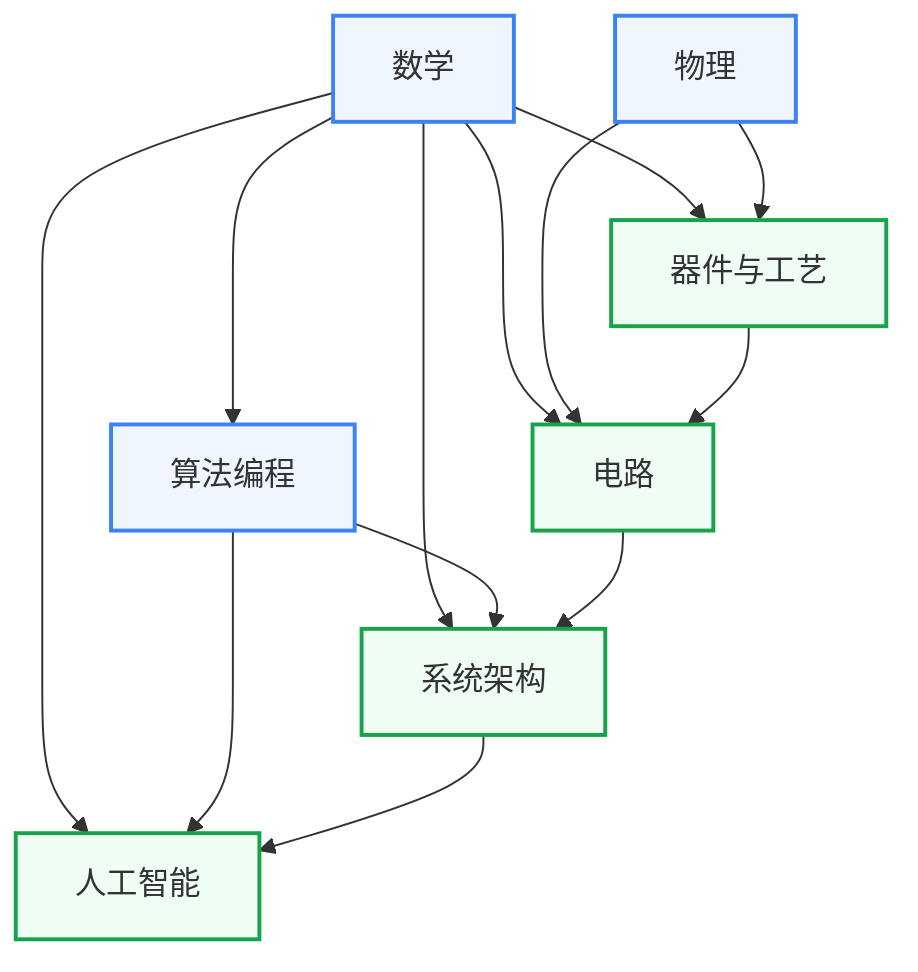
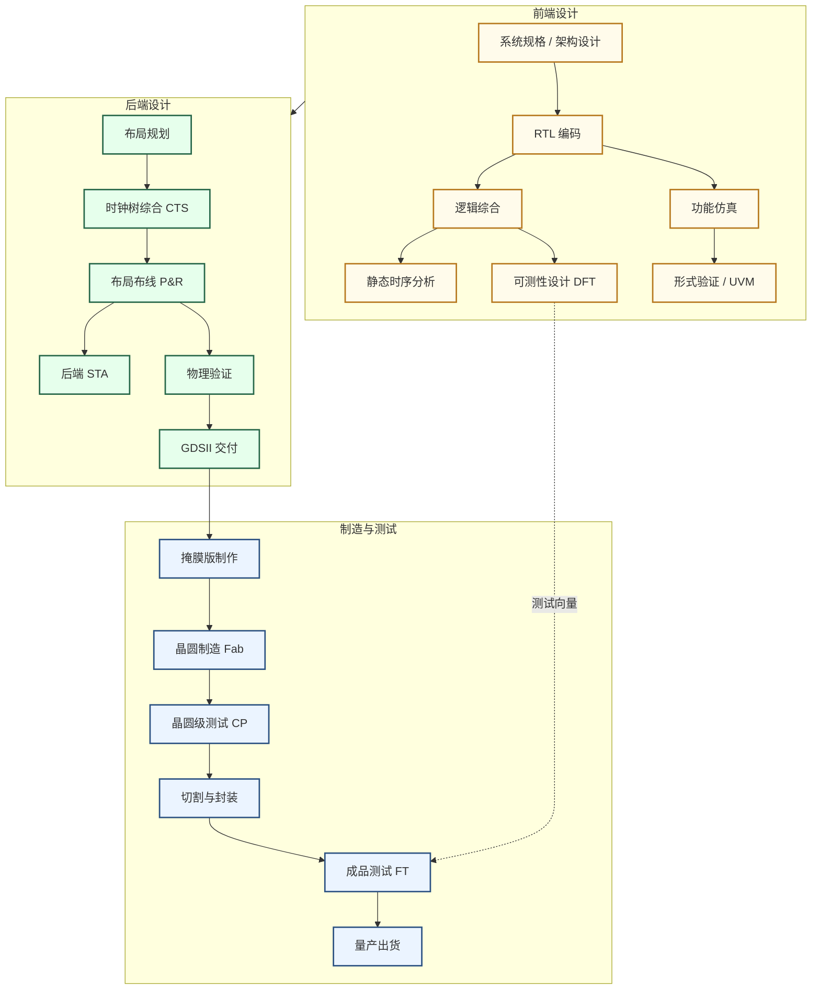

# 学习地图

学习地图从培养方案出发，按知识领域分为七个板块，每个板块给出可自学的课程直链。与「科研方向」配合使用。科研方向页说明做某个方向需要哪些知识，这里给出对应的课程和学习顺序。

## 七大板块

| 板块 | 定位 |
|---|---|
| [数学](/guide/ic-guide/%E5%AD%A6%E4%B9%A0%E5%9C%B0%E5%9B%BE/%E6%95%B0%E5%AD%A6/index) | 微积分到凸优化，信号处理、机器学习、EDA算法的数学基础 |
| [物理](/guide/ic-guide/%E5%AD%A6%E4%B9%A0%E5%9C%B0%E5%9B%BE/%E7%89%A9%E7%90%86/index) | 量子力学到半导体物理，器件研究和模拟电路的物理前置 |
| [器件与工艺](/guide/ic-guide/%E5%AD%A6%E4%B9%A0%E5%9C%B0%E5%9B%BE/%E5%99%A8%E4%BB%B6%E4%B8%8E%E5%B7%A5%E8%89%BA/index) | 晶体管原理与IC制造工艺，IC设计物理约束的来源 |
| [电路](/guide/ic-guide/%E5%AD%A6%E4%B9%A0%E5%9C%B0%E5%9B%BE/%E7%94%B5%E8%B7%AF/index) | 数字设计、模拟与射频、信号处理三条路线，从逻辑门到射频集成电路 |
| [系统架构](/guide/ic-guide/%E5%AD%A6%E4%B9%A0%E5%9C%B0%E5%9B%BE/%E7%B3%BB%E7%BB%9F%E6%9E%B6%E6%9E%84/index) | 体系结构、操作系统、编译原理，AI系统和处理器设计研究的软件侧知识 |
| [算法编程](/guide/ic-guide/%E5%AD%A6%E4%B9%A0%E5%9C%B0%E5%9B%BE/%E7%AE%97%E6%B3%95%E7%BC%96%E7%A8%8B/index) | 程序设计、数据结构与算法，EDA工具开发和AI框架的编程基础 |
| [人工智能](/guide/ic-guide/%E5%AD%A6%E4%B9%A0%E5%9C%B0%E5%9B%BE/%E4%BA%BA%E5%B7%A5%E6%99%BA%E8%83%BD/index) | 机器学习到大模型系统，AI算法与AI芯片协同设计的知识库 |

复旦课表参考：[2021年课程表](/guide/ic-guide/%E5%AD%A6%E4%B9%A0%E5%9C%B0%E5%9B%BE/%E5%A4%8D%E6%97%A6%E5%BE%AE%E7%94%B5%E5%AD%90%E8%AF%BE%E7%A8%8B%E8%A1%A8) · [2026年课程表](/guide/ic-guide/%E5%AD%A6%E4%B9%A0%E5%9C%B0%E5%9B%BE/%E5%A4%8D%E6%97%A6%E9%9B%86%E6%88%90%E7%94%B5%E8%B7%AF%E8%AF%BE%E7%A8%8B%E8%A1%A8)

!!! note "说明"

    这个仓库尽量为每门课程都提供了中英文版本的课程，但以我个人的力量，难以做到尽善尽美，难免有所疏漏。欢迎大家批评指正。

    另外，如你所见，现在这份学习地图里面有很多复旦的课程，而且很多课程仅对复旦校内开放（都怪复旦的信息化建设不好）。这主要是因为这个仓库最开始由复旦的同学维护，在初期主要服务复旦的同学，所以在这里开设了一个第三方的评教与笔记分享平台。但这只是暂时的，期待后面有更多学校的同学加入分享。

    注：请各位同学尊重老师的知识产权，如若老师没有主动分享课程资源到公网，那大家在分享前请先征得老师同意。至于往年试题......还是私下流传吧。

## 板块间的依赖关系

箭头从前置板块指向后置板块，表示学习后者通常需要先有前者的基础。

数学是除物理以外所有板块的共同基础。物理→器件与工艺→电路构成器件和模拟方向的纵向路径。算法编程→系统架构→人工智能构成数字和AI方向的纵向路径。电路也是系统架构的前置，理解时序、总线、存储层次需要有数字电路的基础。

## 芯片生产流程

下图展示数字 IC 从 RTL 设计到晶圆量产的完整链条，供理解各板块知识在工业流程中的位置参考。模拟/射频 IC 走原理图→版图→后仿路线，流程不同。

## 待补充版块

欢迎补充！推荐方式详见「[参与建设](/guide/ic-guide/%E5%8F%82%E4%B8%8E%E5%BB%BA%E8%AE%BE)」。

### 完全空白的分区

- 电路 → [控制与机器人](/guide/ic-guide/%E5%AD%A6%E4%B9%A0%E5%9C%B0%E5%9B%BE/%E7%94%B5%E8%B7%AF/%E6%8E%A7%E5%88%B6%E4%B8%8E%E6%9C%BA%E5%99%A8%E4%BA%BA/index)
- 电路 → [生物电子](/guide/ic-guide/%E5%AD%A6%E4%B9%A0%E5%9C%B0%E5%9B%BE/%E7%94%B5%E8%B7%AF/%E7%94%9F%E7%89%A9%E7%94%B5%E5%AD%90/index)
- 电路 → [数字验证](/guide/ic-guide/%E5%AD%A6%E4%B9%A0%E5%9C%B0%E5%9B%BE/%E7%94%B5%E8%B7%AF/%E6%95%B0%E5%AD%97%E8%AE%BE%E8%AE%A1/%E6%95%B0%E5%AD%97%E9%AA%8C%E8%AF%81/index)
- 电路 → [功率电子](/guide/ic-guide/%E5%AD%A6%E4%B9%A0%E5%9C%B0%E5%9B%BE/%E7%94%B5%E8%B7%AF/%E6%A8%A1%E6%8B%9F%E4%B8%8E%E5%B0%84%E9%A2%91/%E5%8A%9F%E7%8E%87%E7%94%B5%E5%AD%90/index)
- 人工智能 → [类脑与 SNN](/guide/ic-guide/%E5%AD%A6%E4%B9%A0%E5%9C%B0%E5%9B%BE/%E4%BA%BA%E5%B7%A5%E6%99%BA%E8%83%BD/%E7%B1%BB%E8%84%91%E4%B8%8ESNN/index)

### 骨架课程页

目前有 80 余个课程页只有占位骨架，没有简介、难度评价和学习资源。修过这些课的同学欢迎补全。

器件与工艺（24 个）

- 材料：[复旦：半导体材料](/guide/ic-guide/%E5%AD%A6%E4%B9%A0%E5%9C%B0%E5%9B%BE/%E5%99%A8%E4%BB%B6%E4%B8%8E%E5%B7%A5%E8%89%BA/%E6%9D%90%E6%96%99/FDU_ICSE20003)
- 材料：[复旦：有机微电子技术](/guide/ic-guide/%E5%AD%A6%E4%B9%A0%E5%9C%B0%E5%9B%BE/%E5%99%A8%E4%BB%B6%E4%B8%8E%E5%B7%A5%E8%89%BA/%E6%9D%90%E6%96%99/FDU_ICSE40011)
- 材料：[复旦：电子材料薄膜测试表征方法](/guide/ic-guide/%E5%AD%A6%E4%B9%A0%E5%9C%B0%E5%9B%BE/%E5%99%A8%E4%BB%B6%E4%B8%8E%E5%B7%A5%E8%89%BA/%E6%9D%90%E6%96%99/FDU_ICSE40017)
- 材料：[复旦：材料科学导论](/guide/ic-guide/%E5%AD%A6%E4%B9%A0%E5%9C%B0%E5%9B%BE/%E5%99%A8%E4%BB%B6%E4%B8%8E%E5%B7%A5%E8%89%BA/%E6%9D%90%E6%96%99/FDU_MASE20002)
- 材料：[复旦：电子材料分析](/guide/ic-guide/%E5%AD%A6%E4%B9%A0%E5%9C%B0%E5%9B%BE/%E5%99%A8%E4%BB%B6%E4%B8%8E%E5%B7%A5%E8%89%BA/%E6%9D%90%E6%96%99/FDU_MASE30015)
- 材料：[复旦：薄膜技术](/guide/ic-guide/%E5%AD%A6%E4%B9%A0%E5%9C%B0%E5%9B%BE/%E5%99%A8%E4%BB%B6%E4%B8%8E%E5%B7%A5%E8%89%BA/%E6%9D%90%E6%96%99/FDU_MASE30019)
- 材料：[复旦：材料分析](/guide/ic-guide/%E5%AD%A6%E4%B9%A0%E5%9C%B0%E5%9B%BE/%E5%99%A8%E4%BB%B6%E4%B8%8E%E5%B7%A5%E8%89%BA/%E6%9D%90%E6%96%99/FDU_MASE30023)
- 集成电路工艺：[复旦：集成电路制造仿真模拟原理和应用](/guide/ic-guide/%E5%AD%A6%E4%B9%A0%E5%9C%B0%E5%9B%BE/%E5%99%A8%E4%BB%B6%E4%B8%8E%E5%B7%A5%E8%89%BA/%E9%9B%86%E6%88%90%E7%94%B5%E8%B7%AF%E5%B7%A5%E8%89%BA/FDU_ICSE30014)
- 集成电路工艺：[复旦：现代集成电路光刻技术导论](/guide/ic-guide/%E5%AD%A6%E4%B9%A0%E5%9C%B0%E5%9B%BE/%E5%99%A8%E4%BB%B6%E4%B8%8E%E5%B7%A5%E8%89%BA/%E9%9B%86%E6%88%90%E7%94%B5%E8%B7%AF%E5%B7%A5%E8%89%BA/FDU_ICSE30032)
- 集成电路工艺：[复旦：集成电路纳米技术](/guide/ic-guide/%E5%AD%A6%E4%B9%A0%E5%9C%B0%E5%9B%BE/%E5%99%A8%E4%BB%B6%E4%B8%8E%E5%B7%A5%E8%89%BA/%E9%9B%86%E6%88%90%E7%94%B5%E8%B7%AF%E5%B7%A5%E8%89%BA/FDU_ICSE40003)
- 集成电路工艺：[复旦：先进集成电路工艺技术](/guide/ic-guide/%E5%AD%A6%E4%B9%A0%E5%9C%B0%E5%9B%BE/%E5%99%A8%E4%BB%B6%E4%B8%8E%E5%B7%A5%E8%89%BA/%E9%9B%86%E6%88%90%E7%94%B5%E8%B7%AF%E5%B7%A5%E8%89%BA/FDU_ICSE40016)
- 存储器：[复旦：存储器技术](/guide/ic-guide/%E5%AD%A6%E4%B9%A0%E5%9C%B0%E5%9B%BE/%E5%99%A8%E4%BB%B6%E4%B8%8E%E5%B7%A5%E8%89%BA/%E5%AD%98%E5%82%A8%E5%99%A8/FDU_ICSE30005)
- 存储器：[复旦：闪存（FLASH）存储器技术与设计实现](/guide/ic-guide/%E5%AD%A6%E4%B9%A0%E5%9C%B0%E5%9B%BE/%E5%99%A8%E4%BB%B6%E4%B8%8E%E5%B7%A5%E8%89%BA/%E5%AD%98%E5%82%A8%E5%99%A8/FDU_ICSE30024)
- 存储器：[复旦：存储器电路设计导论](/guide/ic-guide/%E5%AD%A6%E4%B9%A0%E5%9C%B0%E5%9B%BE/%E5%99%A8%E4%BB%B6%E4%B8%8E%E5%B7%A5%E8%89%BA/%E5%AD%98%E5%82%A8%E5%99%A8/FDU_ICSE30025)
- 前沿器件：[复旦：新型微纳器件概论](/guide/ic-guide/%E5%AD%A6%E4%B9%A0%E5%9C%B0%E5%9B%BE/%E5%99%A8%E4%BB%B6%E4%B8%8E%E5%B7%A5%E8%89%BA/%E5%89%8D%E6%B2%BF%E5%99%A8%E4%BB%B6/FDU_ICSE30012)
- 前沿器件：[复旦：半导体表面与界面](/guide/ic-guide/%E5%AD%A6%E4%B9%A0%E5%9C%B0%E5%9B%BE/%E5%99%A8%E4%BB%B6%E4%B8%8E%E5%B7%A5%E8%89%BA/%E5%89%8D%E6%B2%BF%E5%99%A8%E4%BB%B6/FDU_ICSE30029)
- 前沿器件：[复旦：超低功耗半导体器件](/guide/ic-guide/%E5%AD%A6%E4%B9%A0%E5%9C%B0%E5%9B%BE/%E5%99%A8%E4%BB%B6%E4%B8%8E%E5%B7%A5%E8%89%BA/%E5%89%8D%E6%B2%BF%E5%99%A8%E4%BB%B6/FDU_ICSE30031)
- 先进封装：[复旦：微电子封装材料及工艺](/guide/ic-guide/%E5%AD%A6%E4%B9%A0%E5%9C%B0%E5%9B%BE/%E5%99%A8%E4%BB%B6%E4%B8%8E%E5%B7%A5%E8%89%BA/%E5%85%88%E8%BF%9B%E5%B0%81%E8%A3%85/FDU_ICSE30013)
- 先进封装：[复旦：集成电路封装与测试](/guide/ic-guide/%E5%AD%A6%E4%B9%A0%E5%9C%B0%E5%9B%BE/%E5%99%A8%E4%BB%B6%E4%B8%8E%E5%B7%A5%E8%89%BA/%E5%85%88%E8%BF%9B%E5%B0%81%E8%A3%85/FDU_ICSE40004)
- 先进封装：[复旦：先进封装](/guide/ic-guide/%E5%AD%A6%E4%B9%A0%E5%9C%B0%E5%9B%BE/%E5%99%A8%E4%BB%B6%E4%B8%8E%E5%B7%A5%E8%89%BA/%E5%85%88%E8%BF%9B%E5%B0%81%E8%A3%85/FDU_ICSE40006)
- 半导体器件：[复旦：半导体器件原理](/guide/ic-guide/%E5%AD%A6%E4%B9%A0%E5%9C%B0%E5%9B%BE/%E5%99%A8%E4%BB%B6%E4%B8%8E%E5%B7%A5%E8%89%BA/%E5%8D%8A%E5%AF%BC%E4%BD%93%E5%99%A8%E4%BB%B6/FDU_MICR130006)
- 功率半导体器件：[复旦：特色工艺与功率半导体技术](/guide/ic-guide/%E5%AD%A6%E4%B9%A0%E5%9C%B0%E5%9B%BE/%E5%99%A8%E4%BB%B6%E4%B8%8E%E5%B7%A5%E8%89%BA/%E5%8A%9F%E7%8E%87%E5%8D%8A%E5%AF%BC%E4%BD%93%E5%99%A8%E4%BB%B6/FDU_ICSE20012)
- MEMS：[复旦：传感器原理及应用](/guide/ic-guide/%E5%AD%A6%E4%B9%A0%E5%9C%B0%E5%9B%BE/%E5%99%A8%E4%BB%B6%E4%B8%8E%E5%B7%A5%E8%89%BA/MEMS/FDU_ICSE30023)
- MEMS：[复旦：微机电系统应用](/guide/ic-guide/%E5%AD%A6%E4%B9%A0%E5%9C%B0%E5%9B%BE/%E5%99%A8%E4%BB%B6%E4%B8%8E%E5%B7%A5%E8%89%BA/MEMS/FDU_ICSE40015)

电路（22 个）

- EDA：[复旦：器件模型与SPICE仿真](/guide/ic-guide/%E5%AD%A6%E4%B9%A0%E5%9C%B0%E5%9B%BE/%E7%94%B5%E8%B7%AF/EDA/FDU_ICSE30002)
- EDA：[复旦：模拟集成电路设计自动化基础](/guide/ic-guide/%E5%AD%A6%E4%B9%A0%E5%9C%B0%E5%9B%BE/%E7%94%B5%E8%B7%AF/EDA/FDU_ICSE30018)
- EDA：[复旦：数字集成电路设计自动化基础](/guide/ic-guide/%E5%AD%A6%E4%B9%A0%E5%9C%B0%E5%9B%BE/%E7%94%B5%E8%B7%AF/EDA/FDU_ICSE30019)
- EDA：[复旦：EDA系统软件分析和设计方法学](/guide/ic-guide/%E5%AD%A6%E4%B9%A0%E5%9C%B0%E5%9B%BE/%E7%94%B5%E8%B7%AF/EDA/FDU_ICSE30028)
- 电路实验：[复旦：模拟与数字电路实验](/guide/ic-guide/%E5%AD%A6%E4%B9%A0%E5%9C%B0%E5%9B%BE/%E7%94%B5%E8%B7%AF/%E7%94%B5%E8%B7%AF%E5%AE%9E%E9%AA%8C/FDU_EST40012)
- 电路实验：[复旦：集成电路实验(上)](/guide/ic-guide/%E5%AD%A6%E4%B9%A0%E5%9C%B0%E5%9B%BE/%E7%94%B5%E8%B7%AF/%E7%94%B5%E8%B7%AF%E5%AE%9E%E9%AA%8C/FDU_ICSE40008)
- 电路实验：[复旦：集成电路实验(下)](/guide/ic-guide/%E5%AD%A6%E4%B9%A0%E5%9C%B0%E5%9B%BE/%E7%94%B5%E8%B7%AF/%E7%94%B5%E8%B7%AF%E5%AE%9E%E9%AA%8C/FDU_ICSE40009)
- 电路实验：[复旦：集成电路设计实验](/guide/ic-guide/%E5%AD%A6%E4%B9%A0%E5%9C%B0%E5%9B%BE/%E7%94%B5%E8%B7%AF/%E7%94%B5%E8%B7%AF%E5%AE%9E%E9%AA%8C/FDU_ICSE40014)
- 测试与可靠性：[复旦：模拟电路测试原理](/guide/ic-guide/%E5%AD%A6%E4%B9%A0%E5%9C%B0%E5%9B%BE/%E7%94%B5%E8%B7%AF/%E6%B5%8B%E8%AF%95%E4%B8%8E%E5%8F%AF%E9%9D%A0%E6%80%A7/FDU_ICSE30003)
- 测试与可靠性：[复旦：模拟测试原理与电路设计](/guide/ic-guide/%E5%AD%A6%E4%B9%A0%E5%9C%B0%E5%9B%BE/%E7%94%B5%E8%B7%AF/%E6%B5%8B%E8%AF%95%E4%B8%8E%E5%8F%AF%E9%9D%A0%E6%80%A7/FDU_ICSE30033)
- 测试与可靠性：[复旦：射频微波测试基础](/guide/ic-guide/%E5%AD%A6%E4%B9%A0%E5%9C%B0%E5%9B%BE/%E7%94%B5%E8%B7%AF/%E6%B5%8B%E8%AF%95%E4%B8%8E%E5%8F%AF%E9%9D%A0%E6%80%A7/FDU_ICSE40010)
- 测试与可靠性：[复旦：器件可靠性原理与测试](/guide/ic-guide/%E5%AD%A6%E4%B9%A0%E5%9C%B0%E5%9B%BE/%E7%94%B5%E8%B7%AF/%E6%B5%8B%E8%AF%95%E4%B8%8E%E5%8F%AF%E9%9D%A0%E6%80%A7/FDU_ICSE50008)
- 信号处理：[复旦：模拟信号处理](/guide/ic-guide/%E5%AD%A6%E4%B9%A0%E5%9C%B0%E5%9B%BE/%E7%94%B5%E8%B7%AF/%E4%BF%A1%E5%8F%B7%E5%A4%84%E7%90%86/FDU_ICSE30030)
- 模拟与射频/射频电路：[复旦：高频电子线路A](/guide/ic-guide/%E5%AD%A6%E4%B9%A0%E5%9C%B0%E5%9B%BE/%E7%94%B5%E8%B7%AF/%E6%A8%A1%E6%8B%9F%E4%B8%8E%E5%B0%84%E9%A2%91/%E5%B0%84%E9%A2%91%E7%94%B5%E8%B7%AF/FDU_ICSE20001)
- 模拟与射频/版图设计：[复旦：集成电路版图设计基础](/guide/ic-guide/%E5%AD%A6%E4%B9%A0%E5%9C%B0%E5%9B%BE/%E7%94%B5%E8%B7%AF/%E6%A8%A1%E6%8B%9F%E4%B8%8E%E5%B0%84%E9%A2%91/%E7%89%88%E5%9B%BE%E8%AE%BE%E8%AE%A1/FDU_ICSE20015)
- 模拟与射频/模拟电子线路：[Razavi Electronics 2（UCLA）](/guide/ic-guide/%E5%AD%A6%E4%B9%A0%E5%9C%B0%E5%9B%BE/%E7%94%B5%E8%B7%AF/%E6%A8%A1%E6%8B%9F%E4%B8%8E%E5%B0%84%E9%A2%91/%E6%A8%A1%E6%8B%9F%E7%94%B5%E5%AD%90%E7%BA%BF%E8%B7%AF/razavi_e2)
- 数字设计/ASIC与数字后端：[复旦：数字电路逻辑综合及描述方法概论](/guide/ic-guide/%E5%AD%A6%E4%B9%A0%E5%9C%B0%E5%9B%BE/%E7%94%B5%E8%B7%AF/%E6%95%B0%E5%AD%97%E8%AE%BE%E8%AE%A1/ASIC%E4%B8%8E%E6%95%B0%E5%AD%97%E5%90%8E%E7%AB%AF/FDU_ICSE20016)
- 数字设计/ASIC与数字后端：[NPTEL：Synthesis of Digital Systems](/guide/ic-guide/%E5%AD%A6%E4%B9%A0%E5%9C%B0%E5%9B%BE/%E7%94%B5%E8%B7%AF/%E6%95%B0%E5%AD%97%E8%AE%BE%E8%AE%A1/ASIC%E4%B8%8E%E6%95%B0%E5%AD%97%E5%90%8E%E7%AB%AF/NPTEL_synthesis)
- 数字设计/HDL：[复旦：集成电路高级硬件描述语言](/guide/ic-guide/%E5%AD%A6%E4%B9%A0%E5%9C%B0%E5%9B%BE/%E7%94%B5%E8%B7%AF/%E6%95%B0%E5%AD%97%E8%AE%BE%E8%AE%A1/HDL/FDU_ICSE30027)
- 数字设计/HDL/HLS：[高亚军：跟 Xilinx SAE 学 HLS](/guide/ic-guide/%E5%AD%A6%E4%B9%A0%E5%9C%B0%E5%9B%BE/%E7%94%B5%E8%B7%AF/%E6%95%B0%E5%AD%97%E8%AE%BE%E8%AE%A1/HDL/HLS/gaoyajun_hls)
- 数字设计/HDL/HLS：[HLS Programming with FPGAs（Lehigh）](/guide/ic-guide/%E5%AD%A6%E4%B9%A0%E5%9C%B0%E5%9B%BE/%E7%94%B5%E8%B7%AF/%E6%95%B0%E5%AD%97%E8%AE%BE%E8%AE%A1/HDL/HLS/Lehigh_hls)
- 数字设计/低功耗设计：[复旦：超低功耗集成电路设计](/guide/ic-guide/%E5%AD%A6%E4%B9%A0%E5%9C%B0%E5%9B%BE/%E7%94%B5%E8%B7%AF/%E6%95%B0%E5%AD%97%E8%AE%BE%E8%AE%A1/%E4%BD%8E%E5%8A%9F%E8%80%97%E8%AE%BE%E8%AE%A1/FDU_ICSE40005)

人工智能（11 个）

- AI交叉应用：[复旦：自动驾驶人工智能原理与实践](/guide/ic-guide/%E5%AD%A6%E4%B9%A0%E5%9C%B0%E5%9B%BE/%E4%BA%BA%E5%B7%A5%E6%99%BA%E8%83%BD/AI%E4%BA%A4%E5%8F%89%E5%BA%94%E7%94%A8/FDU_AIT410017)
- AI交叉应用：[复旦：人工智能的计算机软件基础](/guide/ic-guide/%E5%AD%A6%E4%B9%A0%E5%9C%B0%E5%9B%BE/%E4%BA%BA%E5%B7%A5%E6%99%BA%E8%83%BD/AI%E4%BA%A4%E5%8F%89%E5%BA%94%E7%94%A8/FDU_EST30001)
- AI交叉应用：[复旦：AI半导体制造工艺](/guide/ic-guide/%E5%AD%A6%E4%B9%A0%E5%9C%B0%E5%9B%BE/%E4%BA%BA%E5%B7%A5%E6%99%BA%E8%83%BD/AI%E4%BA%A4%E5%8F%89%E5%BA%94%E7%94%A8/FDU_ICSE30035)
- AI交叉应用：[复旦：人工智能算法在EDA的应用](/guide/ic-guide/%E5%AD%A6%E4%B9%A0%E5%9C%B0%E5%9B%BE/%E4%BA%BA%E5%B7%A5%E6%99%BA%E8%83%BD/AI%E4%BA%A4%E5%8F%89%E5%BA%94%E7%94%A8/FDU_ICSE40019)
- 机器学习理论：[CMU 10-708: Probabilistic Graphical Models](/guide/ic-guide/%E5%AD%A6%E4%B9%A0%E5%9C%B0%E5%9B%BE/%E4%BA%BA%E5%B7%A5%E6%99%BA%E8%83%BD/%E6%9C%BA%E5%99%A8%E5%AD%A6%E4%B9%A0%E7%90%86%E8%AE%BA/CMU_10-708)
- 机器学习理论：[Stanford CS229M: Machine Learning Theory](/guide/ic-guide/%E5%AD%A6%E4%B9%A0%E5%9C%B0%E5%9B%BE/%E4%BA%BA%E5%B7%A5%E6%99%BA%E8%83%BD/%E6%9C%BA%E5%99%A8%E5%AD%A6%E4%B9%A0%E7%90%86%E8%AE%BA/Stanford_CS229M)
- 入门速成：[复旦：人工智能导论](/guide/ic-guide/%E5%AD%A6%E4%B9%A0%E5%9C%B0%E5%9B%BE/%E4%BA%BA%E5%B7%A5%E6%99%BA%E8%83%BD/%E5%85%A5%E9%97%A8%E9%80%9F%E6%88%90/FDU_EST10001)
- 入门速成：[浙大 吴飞：人工智能：模型与算法](/guide/ic-guide/%E5%AD%A6%E4%B9%A0%E5%9C%B0%E5%9B%BE/%E4%BA%BA%E5%B7%A5%E6%99%BA%E8%83%BD/%E5%85%A5%E9%97%A8%E9%80%9F%E6%88%90/ZJU_wufei_AI)
- 深度学习：[李沐：动手学深度学习 v2](/guide/ic-guide/%E5%AD%A6%E4%B9%A0%E5%9C%B0%E5%9B%BE/%E4%BA%BA%E5%B7%A5%E6%99%BA%E8%83%BD/%E6%B7%B1%E5%BA%A6%E5%AD%A6%E4%B9%A0/limu_d2l)
- 机器学习：[复旦：机器学习算法](/guide/ic-guide/%E5%AD%A6%E4%B9%A0%E5%9C%B0%E5%9B%BE/%E4%BA%BA%E5%B7%A5%E6%99%BA%E8%83%BD/%E6%9C%BA%E5%99%A8%E5%AD%A6%E4%B9%A0/FDU_ICSE30001)
- 大语言模型：[复旦：自然语言处理与大语言模型算法](/guide/ic-guide/%E5%AD%A6%E4%B9%A0%E5%9C%B0%E5%9B%BE/%E4%BA%BA%E5%B7%A5%E6%99%BA%E8%83%BD/%E5%A4%A7%E8%AF%AD%E8%A8%80%E6%A8%A1%E5%9E%8B/FDU_EST20001)

系统架构（7 个）

- AI加速器：[复旦：AI专用芯片设计](/guide/ic-guide/%E5%AD%A6%E4%B9%A0%E5%9C%B0%E5%9B%BE/%E7%B3%BB%E7%BB%9F%E6%9E%B6%E6%9E%84/AI%E5%8A%A0%E9%80%9F%E5%99%A8/FDU_ICSE30036)
- AI加速器：[复旦：AI专用处理器架构设计方法](/guide/ic-guide/%E5%AD%A6%E4%B9%A0%E5%9C%B0%E5%9B%BE/%E7%B3%BB%E7%BB%9F%E6%9E%B6%E6%9E%84/AI%E5%8A%A0%E9%80%9F%E5%99%A8/FDU_ICSE40002)
- AI加速器：[复旦：基于FPGA的人工智能算法加速及应用](/guide/ic-guide/%E5%AD%A6%E4%B9%A0%E5%9C%B0%E5%9B%BE/%E7%B3%BB%E7%BB%9F%E6%9E%B6%E6%9E%84/AI%E5%8A%A0%E9%80%9F%E5%99%A8/FDU_ICSE40018)
- GPU体系结构：[NPTEL：GPU Architectures and Programming](/guide/ic-guide/%E5%AD%A6%E4%B9%A0%E5%9C%B0%E5%9B%BE/%E7%B3%BB%E7%BB%9F%E6%9E%B6%E6%9E%84/GPU%E4%BD%93%E7%B3%BB%E7%BB%93%E6%9E%84/NPTEL_GPU)
- GPU体系结构：[ZOMI 酱：GPU 架构原理系列](/guide/ic-guide/%E5%AD%A6%E4%B9%A0%E5%9C%B0%E5%9B%BE/%E7%B3%BB%E7%BB%9F%E6%9E%B6%E6%9E%84/GPU%E4%BD%93%E7%B3%BB%E7%BB%93%E6%9E%84/ZOMI_GPU)
- 并行与分布式系统：[双笙子佯谬：高性能并行编程与优化](/guide/ic-guide/%E5%AD%A6%E4%B9%A0%E5%9C%B0%E5%9B%BE/%E7%B3%BB%E7%BB%9F%E6%9E%B6%E6%9E%84/%E5%B9%B6%E8%A1%8C%E4%B8%8E%E5%88%86%E5%B8%83%E5%BC%8F%E7%B3%BB%E7%BB%9F/parallel101)
- 并行与分布式系统：[中科大：并行计算（国家精品）](/guide/ic-guide/%E5%AD%A6%E4%B9%A0%E5%9C%B0%E5%9B%BE/%E7%B3%BB%E7%BB%9F%E6%9E%B6%E6%9E%84/%E5%B9%B6%E8%A1%8C%E4%B8%8E%E5%88%86%E5%B8%83%E5%BC%8F%E7%B3%BB%E7%BB%9F/USTC_parallel)

算法编程（8 个）

- 编程入门：[复旦：程序设计](/guide/ic-guide/%E5%AD%A6%E4%B9%A0%E5%9C%B0%E5%9B%BE/%E7%AE%97%E6%B3%95%E7%BC%96%E7%A8%8B/%E7%BC%96%E7%A8%8B%E5%85%A5%E9%97%A8/FDU_CS10004)
- 编程入门：[复旦：Perl语言入门和提高](/guide/ic-guide/%E5%AD%A6%E4%B9%A0%E5%9C%B0%E5%9B%BE/%E7%AE%97%E6%B3%95%E7%BC%96%E7%A8%8B/%E7%BC%96%E7%A8%8B%E5%85%A5%E9%97%A8/FDU_ICSE20002)
- 编程入门：[复旦：计算机软件基础](/guide/ic-guide/%E5%AD%A6%E4%B9%A0%E5%9C%B0%E5%9B%BE/%E7%AE%97%E6%B3%95%E7%BC%96%E7%A8%8B/%E7%BC%96%E7%A8%8B%E5%85%A5%E9%97%A8/FDU_ICSE20014)
- 编程入门/C：[北大 郭炜：程序设计与算法（一）C语言](/guide/ic-guide/%E5%AD%A6%E4%B9%A0%E5%9C%B0%E5%9B%BE/%E7%AE%97%E6%B3%95%E7%BC%96%E7%A8%8B/%E7%BC%96%E7%A8%8B%E5%85%A5%E9%97%A8/C/PKU_guowei_C)
- 编程入门/C：[浙大 翁恺：C语言程序设计](/guide/ic-guide/%E5%AD%A6%E4%B9%A0%E5%9C%B0%E5%9B%BE/%E7%AE%97%E6%B3%95%E7%BC%96%E7%A8%8B/%E7%BC%96%E7%A8%8B%E5%85%A5%E9%97%A8/C/ZJU_wengkai)
- 编程入门/Python：[北大 陈斌：数据结构与算法 Python 版](/guide/ic-guide/%E5%AD%A6%E4%B9%A0%E5%9C%B0%E5%9B%BE/%E7%AE%97%E6%B3%95%E7%BC%96%E7%A8%8B/%E7%BC%96%E7%A8%8B%E5%85%A5%E9%97%A8/Python/PKU_chenbin_python)
- 编程入门/Rust：[令狐壹冲：Rust 编程视频教程](/guide/ic-guide/%E5%AD%A6%E4%B9%A0%E5%9C%B0%E5%9B%BE/%E7%AE%97%E6%B3%95%E7%BC%96%E7%A8%8B/%E7%BC%96%E7%A8%8B%E5%85%A5%E9%97%A8/Rust/linghu_rust)
- 编程入门/Rust：[杨旭：Rust 编程语言入门教程](/guide/ic-guide/%E5%AD%A6%E4%B9%A0%E5%9C%B0%E5%9B%BE/%E7%AE%97%E6%B3%95%E7%BC%96%E7%A8%8B/%E7%BC%96%E7%A8%8B%E5%85%A5%E9%97%A8/Rust/yangxu_rust)

物理（8 个）

- 光学：[复旦：光电子器件与集成](/guide/ic-guide/%E5%AD%A6%E4%B9%A0%E5%9C%B0%E5%9B%BE/%E7%89%A9%E7%90%86/%E5%85%89%E5%AD%A6/FDU_ICSE30004)
- 光学：[复旦：半导体光电子器件](/guide/ic-guide/%E5%AD%A6%E4%B9%A0%E5%9C%B0%E5%9B%BE/%E7%89%A9%E7%90%86/%E5%85%89%E5%AD%A6/FDU_ICSE30008)
- 半导体物理：[复旦：半导体物理](/guide/ic-guide/%E5%AD%A6%E4%B9%A0%E5%9C%B0%E5%9B%BE/%E7%89%A9%E7%90%86/%E5%8D%8A%E5%AF%BC%E4%BD%93%E7%89%A9%E7%90%86/FDU_MICR130005)
- 物理实验：[复旦：基础物理实验](/guide/ic-guide/%E5%AD%A6%E4%B9%A0%E5%9C%B0%E5%9B%BE/%E7%89%A9%E7%90%86/%E7%89%A9%E7%90%86%E5%AE%9E%E9%AA%8C/FDU_PHYS120015)
- 热力学与统计物理：[复旦：热力学与统计物理I](/guide/ic-guide/%E5%AD%A6%E4%B9%A0%E5%9C%B0%E5%9B%BE/%E7%89%A9%E7%90%86/%E7%83%AD%E5%8A%9B%E5%AD%A6%E4%B8%8E%E7%BB%9F%E8%AE%A1%E7%89%A9%E7%90%86/FDU_PHYS20013)
- 固体物理：[复旦：固体物理（物理系）](/guide/ic-guide/%E5%AD%A6%E4%B9%A0%E5%9C%B0%E5%9B%BE/%E7%89%A9%E7%90%86/%E5%9B%BA%E4%BD%93%E7%89%A9%E7%90%86/FDU_PHYS30011)
- 电磁场与微波：[复旦：电磁场与电磁波](/guide/ic-guide/%E5%AD%A6%E4%B9%A0%E5%9C%B0%E5%9B%BE/%E7%89%A9%E7%90%86/%E7%94%B5%E7%A3%81%E5%9C%BA%E4%B8%8E%E5%BE%AE%E6%B3%A2/FDU_ICE50009)
- 量子计算：[北大 李彤阳：量子计算](/guide/ic-guide/%E5%AD%A6%E4%B9%A0%E5%9C%B0%E5%9B%BE/%E7%89%A9%E7%90%86/%E9%87%8F%E5%AD%90%E8%AE%A1%E7%AE%97/PKU_li_quantum)

数学（4 个）

- 代数/线性代数：[复旦：线性代数](/guide/ic-guide/%E5%AD%A6%E4%B9%A0%E5%9C%B0%E5%9B%BE/%E6%95%B0%E5%AD%A6/%E4%BB%A3%E6%95%B0/%E7%BA%BF%E6%80%A7%E4%BB%A3%E6%95%B0/FDU_COMP120004)
- 分析/数学分析：[复旦：高等数学A（上/下）](/guide/ic-guide/%E5%AD%A6%E4%B9%A0%E5%9C%B0%E5%9B%BE/%E6%95%B0%E5%AD%A6/%E5%88%86%E6%9E%90/%E6%95%B0%E5%AD%A6%E5%88%86%E6%9E%90/FDU_MATH10015-16)
- 数值与优化/数值分析：[复旦：计算物理基础](/guide/ic-guide/%E5%AD%A6%E4%B9%A0%E5%9C%B0%E5%9B%BE/%E6%95%B0%E5%AD%A6/%E6%95%B0%E5%80%BC%E4%B8%8E%E4%BC%98%E5%8C%96/%E6%95%B0%E5%80%BC%E5%88%86%E6%9E%90/FDU_PHYS20009)
- 入门速成：[复旦：工程数学及概率方法](/guide/ic-guide/%E5%AD%A6%E4%B9%A0%E5%9C%B0%E5%9B%BE/%E6%95%B0%E5%AD%A6/%E5%85%A5%E9%97%A8%E9%80%9F%E6%88%90/FDU_MICR130008)

