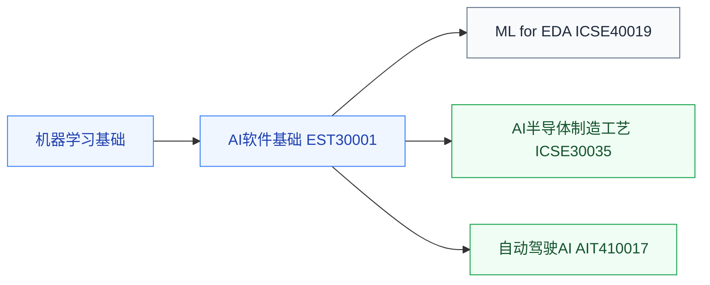

# AI交叉应用

把 AI 用到芯片产业链各环节的课程，与 [AI加速器](/guide/ic-guide/%E5%AD%A6%E4%B9%A0%E5%9C%B0%E5%9B%BE/%E7%B3%BB%E7%BB%9F%E6%9E%B6%E6%9E%84/AI%E5%8A%A0%E9%80%9F%E5%99%A8/index)（为 AI 造芯片）方向相反。前置是[机器学习](/guide/ic-guide/%E5%AD%A6%E4%B9%A0%E5%9C%B0%E5%9B%BE/%E4%BA%BA%E5%B7%A5%E6%99%BA%E8%83%BD/%E6%9C%BA%E5%99%A8%E5%AD%A6%E4%B9%A0/index)基础加各自领域的本体知识。

## 复旦校内课程（2025 培养方案）

以下课程页为占位骨架，欢迎修过的同学通过[参与建设](/guide/ic-guide/%E5%8F%82%E4%B8%8E%E5%BB%BA%E8%AE%BE)补全：

- **[人工智能算法在EDA的应用](/guide/ic-guide/%E5%AD%A6%E4%B9%A0%E5%9C%B0%E5%9B%BE/%E4%BA%BA%E5%B7%A5%E6%99%BA%E8%83%BD/AI%E4%BA%A4%E5%8F%89%E5%BA%94%E7%94%A8/FDU_ICSE40019)** — ML for EDA，先修 [EDA](/guide/ic-guide/%E5%AD%A6%E4%B9%A0%E5%9C%B0%E5%9B%BE/%E7%94%B5%E8%B7%AF/EDA/index)
- **[AI半导体制造工艺](/guide/ic-guide/%E5%AD%A6%E4%B9%A0%E5%9C%B0%E5%9B%BE/%E4%BA%BA%E5%B7%A5%E6%99%BA%E8%83%BD/AI%E4%BA%A4%E5%8F%89%E5%BA%94%E7%94%A8/FDU_ICSE30035)** — AI 用于制造良率与工艺控制，先修[集成电路工艺](/guide/ic-guide/%E5%AD%A6%E4%B9%A0%E5%9C%B0%E5%9B%BE/%E5%99%A8%E4%BB%B6%E4%B8%8E%E5%B7%A5%E8%89%BA/%E9%9B%86%E6%88%90%E7%94%B5%E8%B7%AF%E5%B7%A5%E8%89%BA/FDU_MICR130007)
- **[自动驾驶人工智能原理与实践](/guide/ic-guide/%E5%AD%A6%E4%B9%A0%E5%9C%B0%E5%9B%BE/%E4%BA%BA%E5%B7%A5%E6%99%BA%E8%83%BD/AI%E4%BA%A4%E5%8F%89%E5%BA%94%E7%94%A8/FDU_AIT410017)** — 感知/规划/控制的 AI 方法
- **[人工智能的计算机软件基础](/guide/ic-guide/%E5%AD%A6%E4%B9%A0%E5%9C%B0%E5%9B%BE/%E4%BA%BA%E5%B7%A5%E6%99%BA%E8%83%BD/AI%E4%BA%A4%E5%8F%89%E5%BA%94%E7%94%A8/FDU_EST30001)** — AI 开发的软件工程基础

## 相关科研方向

- [EDA 与设计自动化](/guide/ic-guide/%E7%A7%91%E7%A0%94%E6%96%B9%E5%90%91/EDA%E4%B8%8E%E8%AE%BE%E8%AE%A1%E8%87%AA%E5%8A%A8%E5%8C%96)
- [具身智能](/guide/ic-guide/%E7%A7%91%E7%A0%94%E6%96%B9%E5%90%91/%E5%85%B7%E8%BA%AB%E6%99%BA%E8%83%BD)

