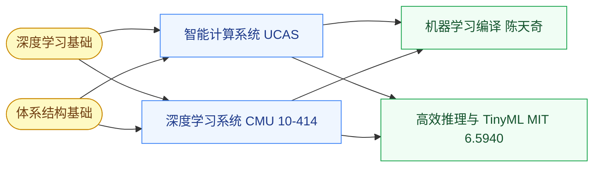

# AI 系统

AI 系统(ML Systems / AI Systems)研究**如何把 AI 模型高效地跑起来**——不是怎么设计更好的算法,而是怎么把现有算法部署到 GPU/NPU/手机/边缘设备上,做到延迟低、吞吐高、功耗省。这是与芯片设计交叉最深的 AI 子方向。

近年最热的话题:**LLM 推理加速、量化、剪枝、稀疏注意力、KV Cache 管理、张量并行**——它们同时投递 NeurIPS/ICML 和 ISCA/ASPLOS,因为本质就是**算法 × 硬件 × 系统**的三方协同。

## 相关科研方向

- [AI 算法与系统](/guide/ic-guide/%E7%A7%91%E7%A0%94%E6%96%B9%E5%90%91/AI%E7%AE%97%E6%B3%95%E4%B8%8E%E7%B3%BB%E7%BB%9F)
- [处理器架构与编译系统](/guide/ic-guide/%E7%A7%91%E7%A0%94%E6%96%B9%E5%90%91/%E5%A4%84%E7%90%86%E5%99%A8%E6%9E%B6%E6%9E%84%E4%B8%8E%E7%BC%96%E8%AF%91%E7%B3%BB%E7%BB%9F)
- [存算一体与近存计算](/guide/ic-guide/%E7%A7%91%E7%A0%94%E6%96%B9%E5%90%91/%E5%AD%98%E7%AE%97%E4%B8%80%E4%BD%93%E4%B8%8E%E8%BF%91%E5%AD%98%E8%AE%A1%E7%AE%97)

