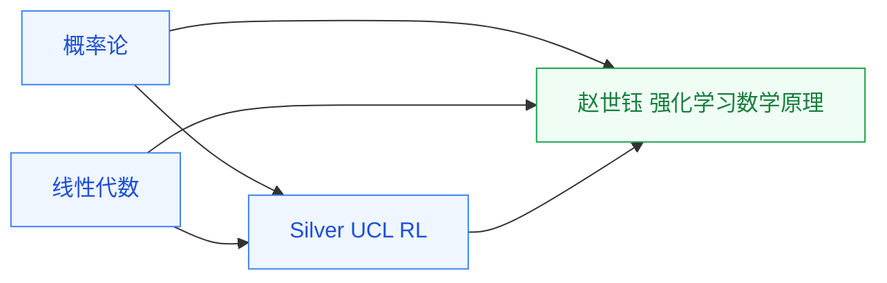

# 强化学习

智能体在交互中学策略的一支,具身智能的控制核心,也用于 EDA 布局布线等决策问题。

## 相关科研方向

- [具身智能](/guide/ic-guide/%E7%A7%91%E7%A0%94%E6%96%B9%E5%90%91/%E5%85%B7%E8%BA%AB%E6%99%BA%E8%83%BD)
- [EDA 与设计自动化](/guide/ic-guide/%E7%A7%91%E7%A0%94%E6%96%B9%E5%90%91/EDA%E4%B8%8E%E8%AE%BE%E8%AE%A1%E8%87%AA%E5%8A%A8%E5%8C%96)

