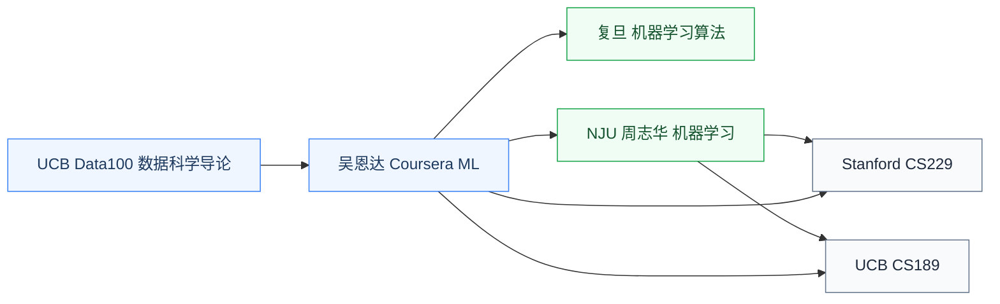

# 机器学习

机器学习是现代 AI 的核心范式:**让计算机从数据中学习规律**,而不是手工编写规则。监督学习、非监督学习、概率模型、优化、泛化理论是这门课的主轴。

对硬件研究者来说,机器学习是**做 AI 硬件协同设计的数学基础**——设计加速器要先理解算子(矩阵乘、卷积、attention)是什么,数据流如何,怎么量化才不损失精度。

## 相关科研方向

- [AI 算法与系统](/guide/ic-guide/%E7%A7%91%E7%A0%94%E6%96%B9%E5%90%91/AI%E7%AE%97%E6%B3%95%E4%B8%8E%E7%B3%BB%E7%BB%9F)
- [类脑芯片](/guide/ic-guide/%E7%A7%91%E7%A0%94%E6%96%B9%E5%90%91/%E7%B1%BB%E8%84%91%E8%8A%AF%E7%89%87)
- [EDA 与设计自动化](/guide/ic-guide/%E7%A7%91%E7%A0%94%E6%96%B9%E5%90%91/EDA%E4%B8%8E%E8%AE%BE%E8%AE%A1%E8%87%AA%E5%8A%A8%E5%8C%96)

