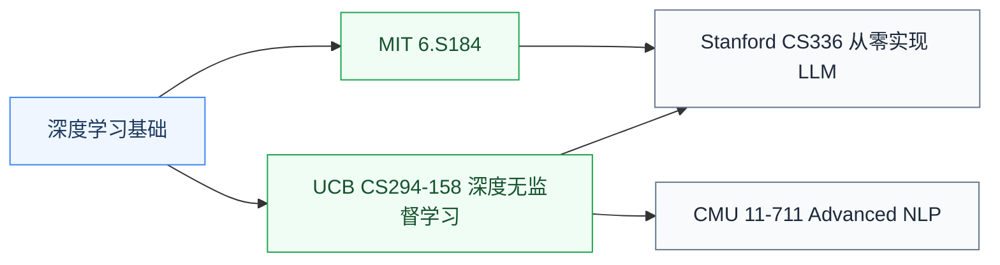

# 深度生成模型

深度生成模型研究**让 AI 能“生成”内容**——文本(LLM)、图像(扩散模型)、3D、音频、视频。这是 2020 年代 AI 革命的核心:ChatGPT、Sora、Stable Diffusion、Midjourney 全部是生成模型。

对硬件研究者来说,生成模型的**算力消耗规律**是设计大规模 AI 系统的关键参考——LLM 训练 / 推理的 memory bandwidth、计算密度、稀疏性都直接决定加速器设计。

## 相关科研方向

- [AI 算法与系统](/guide/ic-guide/%E7%A7%91%E7%A0%94%E6%96%B9%E5%90%91/AI%E7%AE%97%E6%B3%95%E4%B8%8E%E7%B3%BB%E7%BB%9F)
- [处理器架构与编译系统](/guide/ic-guide/%E7%A7%91%E7%A0%94%E6%96%B9%E5%90%91/%E5%A4%84%E7%90%86%E5%99%A8%E6%9E%B6%E6%9E%84%E4%B8%8E%E7%BC%96%E8%AF%91%E7%B3%BB%E7%BB%9F)
- [存算一体与近存计算](/guide/ic-guide/%E7%A7%91%E7%A0%94%E6%96%B9%E5%90%91/%E5%AD%98%E7%AE%97%E4%B8%80%E4%BD%93%E4%B8%8E%E8%BF%91%E5%AD%98%E8%AE%A1%E7%AE%97)

