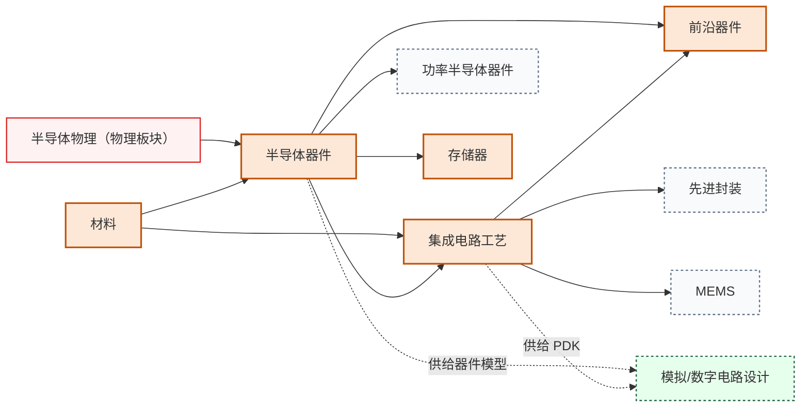

# 器件与工艺

从半导体物理到芯片制造，这个板块回答“芯片是怎么做出来的”。先理解材料中的电子行为，再掌握单个器件的工作原理，最后学习把亿万个器件集成到一块硅片上的工艺流程。

## 课程关系

实线箭头表示先修关系，虚线表示知识供给关系。

主链只有一条，半导体物理 → 半导体器件 → 集成电路工艺，三门课严格递进。功率半导体器件、存储器、前沿器件、先进封装、MEMS 都从这条主链上分出去。这条链的产出（器件模型和 PDK）是电路板块全部设计工作的物理输入。

---

**[半导体器件](半导体器件/)** — MOSFET、BJT、PN 结的工作原理；器件物理是所有电路设计的物理基础。

**[集成电路工艺](集成电路工艺/)** — 光刻、刻蚀、薄膜沉积、离子注入等微纳加工技术；解释芯片是如何从设计图纸变成硅片的。

**[前沿器件](/guide/ic-guide/%E5%AD%A6%E4%B9%A0%E5%9C%B0%E5%9B%BE/%E5%99%A8%E4%BB%B6%E4%B8%8E%E5%B7%A5%E8%89%BA/%E5%89%8D%E6%B2%BF%E5%99%A8%E4%BB%B6/index)** — 超低功耗器件、新型微纳器件、表面与界面；器件物理的研究前沿专题。

**[存储器](/guide/ic-guide/%E5%AD%A6%E4%B9%A0%E5%9C%B0%E5%9B%BE/%E5%99%A8%E4%BB%B6%E4%B8%8E%E5%B7%A5%E8%89%BA/%E5%AD%98%E5%82%A8%E5%99%A8/index)** — 存储器技术、闪存、存储器电路；存算一体方向的本体知识。

**[材料](/guide/ic-guide/%E5%AD%A6%E4%B9%A0%E5%9C%B0%E5%9B%BE/%E5%99%A8%E4%BB%B6%E4%B8%8E%E5%B7%A5%E8%89%BA/%E6%9D%90%E6%96%99/index)** — 半导体材料与表征；器件与工艺研究的材料学支撑。

## 相关科研方向

| 对应科研方向 | 推荐子板块 | 为什么 |
|---|---|---|
| [半导体器件与先进工艺](/guide/ic-guide/%E7%A7%91%E7%A0%94%E6%96%B9%E5%90%91/%E5%8D%8A%E5%AF%BC%E4%BD%93%E5%99%A8%E4%BB%B6%E4%B8%8E%E5%85%88%E8%BF%9B%E5%B7%A5%E8%89%BA) | 全部两个 | 这是该方向的本体课程链 |
| [功率半导体与宽禁带器件](/guide/ic-guide/%E7%A7%91%E7%A0%94%E6%96%B9%E5%90%91/%E5%8A%9F%E7%8E%87%E5%8D%8A%E5%AF%BC%E4%BD%93%E4%B8%8E%E5%AE%BD%E7%A6%81%E5%B8%A6%E5%99%A8%E4%BB%B6) | 半导体器件 | SiC/GaN 高压器件的物理基础 |
| [光电子与硅光集成](/guide/ic-guide/%E7%A7%91%E7%A0%94%E6%96%B9%E5%90%91/%E5%85%89%E7%94%B5%E5%AD%90%E4%B8%8E%E7%A1%85%E5%85%89%E9%9B%86%E6%88%90) | 半导体器件 + 集成电路工艺 | 调制器/探测器都是异质结器件,需要工艺集成 |
| [MEMS 与微纳传感器](/guide/ic-guide/%E7%A7%91%E7%A0%94%E6%96%B9%E5%90%91/MEMS%E4%B8%8E%E5%BE%AE%E7%BA%B3%E4%BC%A0%E6%84%9F%E5%99%A8) | 集成电路工艺 | MEMS 共享 CMOS 微纳加工技术 |
| [先进封装与异构集成](/guide/ic-guide/%E7%A7%91%E7%A0%94%E6%96%B9%E5%90%91/%E5%85%88%E8%BF%9B%E5%B0%81%E8%A3%85%E4%B8%8E%E5%BC%82%E6%9E%84%E9%9B%86%E6%88%90) | 集成电路工艺 | 2.5D/3D 封装、TSV、CoWoS 都建立在工艺基础上 |
| [模拟与混合信号 IC](/guide/ic-guide/%E7%A7%91%E7%A0%94%E6%96%B9%E5%90%91/%E6%A8%A1%E6%8B%9F%E4%B8%8E%E6%B7%B7%E5%90%88%E4%BF%A1%E5%8F%B7IC) | 半导体器件 | 没有器件物理就看不懂 SPICE 模型参数 |
| [存算一体与近存计算](/guide/ic-guide/%E7%A7%91%E7%A0%94%E6%96%B9%E5%90%91/%E5%AD%98%E7%AE%97%E4%B8%80%E4%BD%93%E4%B8%8E%E8%BF%91%E5%AD%98%E8%AE%A1%E7%AE%97) | 半导体器件 | RRAM/PCM/MRAM 等新型存储器件 |

> 想做器件方向的同学,**强烈推荐**先打牢[物理板块](/guide/ic-guide/%E5%AD%A6%E4%B9%A0%E5%9C%B0%E5%9B%BE/%E7%89%A9%E7%90%86/index)中的量子力学和固体物理——直接学半导体物理像听天书。

## 待建的槽位

以下子领域已规划进知识框架，但还没有经过验证的课程推荐。欢迎熟悉这些领域的同学通过[参与建设](/guide/ic-guide/%E5%8F%82%E4%B8%8E%E5%BB%BA%E8%AE%BE)补全：

- [功率半导体器件（SiC/GaN）](/guide/ic-guide/%E5%AD%A6%E4%B9%A0%E5%9C%B0%E5%9B%BE/%E5%99%A8%E4%BB%B6%E4%B8%8E%E5%B7%A5%E8%89%BA/%E5%8A%9F%E7%8E%87%E5%8D%8A%E5%AF%BC%E4%BD%93%E5%99%A8%E4%BB%B6/index)（待建）
- [MEMS 器件与微纳加工](/guide/ic-guide/%E5%AD%A6%E4%B9%A0%E5%9C%B0%E5%9B%BE/%E5%99%A8%E4%BB%B6%E4%B8%8E%E5%B7%A5%E8%89%BA/MEMS/index)（待建）
- [先进封装与异构集成](/guide/ic-guide/%E5%AD%A6%E4%B9%A0%E5%9C%B0%E5%9B%BE/%E5%99%A8%E4%BB%B6%E4%B8%8E%E5%B7%A5%E8%89%BA/%E5%85%88%E8%BF%9B%E5%B0%81%E8%A3%85/index)（待建）
