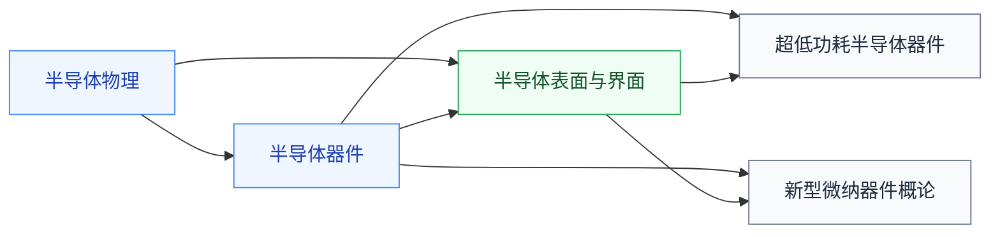

# 前沿器件

器件物理的研究前沿专题。[半导体器件](/guide/ic-guide/%E5%AD%A6%E4%B9%A0%E5%9C%B0%E5%9B%BE/%E5%99%A8%E4%BB%B6%E4%B8%8E%E5%B7%A5%E8%89%BA/%E5%8D%8A%E5%AF%BC%E4%BD%93%E5%99%A8%E4%BB%B6/index)主线讲 PN 结、MOSFET、BJT 的经典原理，这里收前沿分支，适合学完主线、准备进课题组的人。

## 复旦校内课程（2025 培养方案）

以下课程页为占位骨架，欢迎修过的同学通过[参与建设](/guide/ic-guide/%E5%8F%82%E4%B8%8E%E5%BB%BA%E8%AE%BE)补全：

- **[超低功耗半导体器件](/guide/ic-guide/%E5%AD%A6%E4%B9%A0%E5%9C%B0%E5%9B%BE/%E5%99%A8%E4%BB%B6%E4%B8%8E%E5%B7%A5%E8%89%BA/%E5%89%8D%E6%B2%BF%E5%99%A8%E4%BB%B6/FDU_ICSE30031)** — 隧穿晶体管、亚阈值器件等低功耗器件
- **[新型微纳器件概论](/guide/ic-guide/%E5%AD%A6%E4%B9%A0%E5%9C%B0%E5%9B%BE/%E5%99%A8%E4%BB%B6%E4%B8%8E%E5%B7%A5%E8%89%BA/%E5%89%8D%E6%B2%BF%E5%99%A8%E4%BB%B6/FDU_ICSE30012)** — 二维材料、纳米线等新器件概览
- **[半导体表面与界面](/guide/ic-guide/%E5%AD%A6%E4%B9%A0%E5%9C%B0%E5%9B%BE/%E5%99%A8%E4%BB%B6%E4%B8%8E%E5%B7%A5%E8%89%BA/%E5%89%8D%E6%B2%BF%E5%99%A8%E4%BB%B6/FDU_ICSE30029)** — 表面态、界面物理，先修[半导体物理](/guide/ic-guide/%E5%AD%A6%E4%B9%A0%E5%9C%B0%E5%9B%BE/%E7%89%A9%E7%90%86/%E5%8D%8A%E5%AF%BC%E4%BD%93%E7%89%A9%E7%90%86/index)

## 相关科研方向

- [半导体器件与先进工艺](/guide/ic-guide/%E7%A7%91%E7%A0%94%E6%96%B9%E5%90%91/%E5%8D%8A%E5%AF%BC%E4%BD%93%E5%99%A8%E4%BB%B6%E4%B8%8E%E5%85%88%E8%BF%9B%E5%B7%A5%E8%89%BA)
- [存算一体与近存计算](/guide/ic-guide/%E7%A7%91%E7%A0%94%E6%96%B9%E5%90%91/%E5%AD%98%E7%AE%97%E4%B8%80%E4%BD%93%E4%B8%8E%E8%BF%91%E5%AD%98%E8%AE%A1%E7%AE%97)

