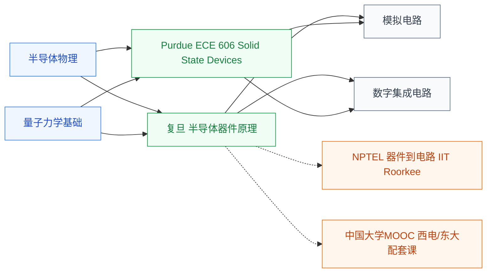

# 半导体器件

半导体器件研究**由半导体材料(主要是硅)制成的电子元件的工作原理**——PN 结、双极结型晶体管(BJT)、金属-氧化物-半导体场效应晶体管(MOSFET)。这些器件是构成所有集成电路的最基本积木:**一颗手机芯片含上百亿个 MOSFET**,每一个的工作原理都来自这门课。

它是连接[半导体物理](/guide/ic-guide/%E5%AD%A6%E4%B9%A0%E5%9C%B0%E5%9B%BE/%E7%89%A9%E7%90%86/%E5%8D%8A%E5%AF%BC%E4%BD%93%E7%89%A9%E7%90%86/index)与[电路设计](/guide/ic-guide/%E5%AD%A6%E4%B9%A0%E5%9C%B0%E5%9B%BE/%E7%94%B5%E8%B7%AF/index)的桥梁——半物给你“载流子和能带”,这门课说明“如何用 PN 结+栅氧化层做出一个有用的开关”。

## 相关科研方向

- [半导体器件与先进工艺](/guide/ic-guide/%E7%A7%91%E7%A0%94%E6%96%B9%E5%90%91/%E5%8D%8A%E5%AF%BC%E4%BD%93%E5%99%A8%E4%BB%B6%E4%B8%8E%E5%85%88%E8%BF%9B%E5%B7%A5%E8%89%BA)
- [模拟与混合信号 IC](/guide/ic-guide/%E7%A7%91%E7%A0%94%E6%96%B9%E5%90%91/%E6%A8%A1%E6%8B%9F%E4%B8%8E%E6%B7%B7%E5%90%88%E4%BF%A1%E5%8F%B7IC)
- [功率半导体与宽禁带器件](/guide/ic-guide/%E7%A7%91%E7%A0%94%E6%96%B9%E5%90%91/%E5%8A%9F%E7%8E%87%E5%8D%8A%E5%AF%BC%E4%BD%93%E4%B8%8E%E5%AE%BD%E7%A6%81%E5%B8%A6%E5%99%A8%E4%BB%B6)
- [光电子与硅光集成](/guide/ic-guide/%E7%A7%91%E7%A0%94%E6%96%B9%E5%90%91/%E5%85%89%E7%94%B5%E5%AD%90%E4%B8%8E%E7%A1%85%E5%85%89%E9%9B%86%E6%88%90)

