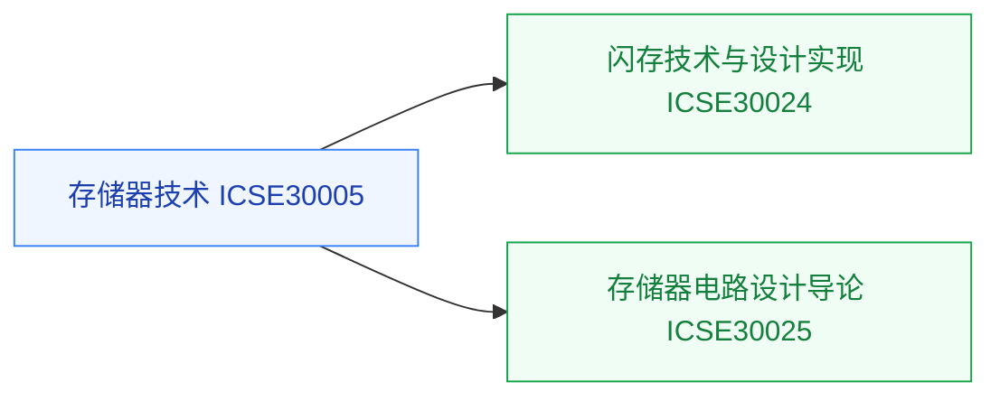

# 存储器

存储器是器件、工艺、电路三层交汇的领域，也是[存算一体与近存计算](/guide/ic-guide/%E7%A7%91%E7%A0%94%E6%96%B9%E5%90%91/%E5%AD%98%E7%AE%97%E4%B8%80%E4%BD%93%E4%B8%8E%E8%BF%91%E5%AD%98%E8%AE%A1%E7%AE%97)方向的本体知识。本目录从器件技术到电路设计覆盖一条线。

## 复旦校内课程（2025 培养方案）

以下课程页为占位骨架，欢迎修过的同学通过[参与建设](/guide/ic-guide/%E5%8F%82%E4%B8%8E%E5%BB%BA%E8%AE%BE)补全：

- **[存储器技术](/guide/ic-guide/%E5%AD%A6%E4%B9%A0%E5%9C%B0%E5%9B%BE/%E5%99%A8%E4%BB%B6%E4%B8%8E%E5%B7%A5%E8%89%BA/%E5%AD%98%E5%82%A8%E5%99%A8/FDU_ICSE30005)** — DRAM/NAND/新型存储的器件与工艺
- **[闪存（FLASH）存储器技术与设计实现](/guide/ic-guide/%E5%AD%A6%E4%B9%A0%E5%9C%B0%E5%9B%BE/%E5%99%A8%E4%BB%B6%E4%B8%8E%E5%B7%A5%E8%89%BA/%E5%AD%98%E5%82%A8%E5%99%A8/FDU_ICSE30024)** — 闪存器件到设计实现
- **[存储器电路设计导论](/guide/ic-guide/%E5%AD%A6%E4%B9%A0%E5%9C%B0%E5%9B%BE/%E5%99%A8%E4%BB%B6%E4%B8%8E%E5%B7%A5%E8%89%BA/%E5%AD%98%E5%82%A8%E5%99%A8/FDU_ICSE30025)** — SRAM/DRAM 外围电路设计

## 公开课程（待补充）

存储器方向的公开视频课程稀缺，欢迎推荐（要求：完整公开视频，附主页与直链，注明学校、教师、讲数）。

## 相关科研方向

- [存算一体与近存计算](/guide/ic-guide/%E7%A7%91%E7%A0%94%E6%96%B9%E5%90%91/%E5%AD%98%E7%AE%97%E4%B8%80%E4%BD%93%E4%B8%8E%E8%BF%91%E5%AD%98%E8%AE%A1%E7%AE%97)
- [半导体器件与先进工艺](/guide/ic-guide/%E7%A7%91%E7%A0%94%E6%96%B9%E5%90%91/%E5%8D%8A%E5%AF%BC%E4%BD%93%E5%99%A8%E4%BB%B6%E4%B8%8E%E5%85%88%E8%BF%9B%E5%B7%A5%E8%89%BA)

