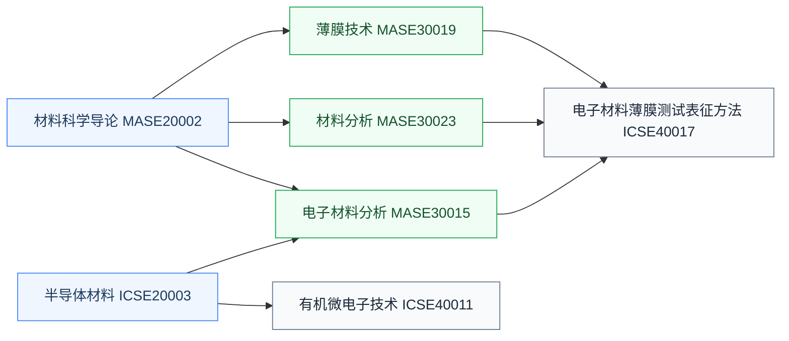

# 材料

半导体材料与材料表征课程，器件与工艺研究的材料学支撑。做器件、工艺、封装方向会反复用到这里的知识。

## 复旦校内课程（2025 培养方案）

以下课程页为占位骨架，欢迎修过的同学通过[参与建设](/guide/ic-guide/%E5%8F%82%E4%B8%8E%E5%BB%BA%E8%AE%BE)补全：

- **[半导体材料](/guide/ic-guide/%E5%AD%A6%E4%B9%A0%E5%9C%B0%E5%9B%BE/%E5%99%A8%E4%BB%B6%E4%B8%8E%E5%B7%A5%E8%89%BA/%E6%9D%90%E6%96%99/FDU_ICSE20003)** — 硅、化合物半导体与新材料体系
- **[材料科学导论](/guide/ic-guide/%E5%AD%A6%E4%B9%A0%E5%9C%B0%E5%9B%BE/%E5%99%A8%E4%BB%B6%E4%B8%8E%E5%B7%A5%E8%89%BA/%E6%9D%90%E6%96%99/FDU_MASE20002)** — 材料系导论课
- **[薄膜技术](/guide/ic-guide/%E5%AD%A6%E4%B9%A0%E5%9C%B0%E5%9B%BE/%E5%99%A8%E4%BB%B6%E4%B8%8E%E5%B7%A5%E8%89%BA/%E6%9D%90%E6%96%99/FDU_MASE30019)** — 薄膜生长与制备工艺
- **[材料分析](/guide/ic-guide/%E5%AD%A6%E4%B9%A0%E5%9C%B0%E5%9B%BE/%E5%99%A8%E4%BB%B6%E4%B8%8E%E5%B7%A5%E8%89%BA/%E6%9D%90%E6%96%99/FDU_MASE30023)** — 材料表征方法
- **[电子材料分析](/guide/ic-guide/%E5%AD%A6%E4%B9%A0%E5%9C%B0%E5%9B%BE/%E5%99%A8%E4%BB%B6%E4%B8%8E%E5%B7%A5%E8%89%BA/%E6%9D%90%E6%96%99/FDU_MASE30015)** — 面向电子材料的分析手段
- **[电子材料薄膜测试表征方法](/guide/ic-guide/%E5%AD%A6%E4%B9%A0%E5%9C%B0%E5%9B%BE/%E5%99%A8%E4%BB%B6%E4%B8%8E%E5%B7%A5%E8%89%BA/%E6%9D%90%E6%96%99/FDU_ICSE40017)** — 薄膜的测试与表征
- **[有机微电子技术](/guide/ic-guide/%E5%AD%A6%E4%B9%A0%E5%9C%B0%E5%9B%BE/%E5%99%A8%E4%BB%B6%E4%B8%8E%E5%B7%A5%E8%89%BA/%E6%9D%90%E6%96%99/FDU_ICSE40011)** — 有机半导体器件与工艺

## 公开课程（待补充）

材料类公开视频课程欢迎推荐（要求：完整公开视频，附主页与直链，注明学校、教师、讲数）。

## 相关科研方向

- [半导体器件与先进工艺](/guide/ic-guide/%E7%A7%91%E7%A0%94%E6%96%B9%E5%90%91/%E5%8D%8A%E5%AF%BC%E4%BD%93%E5%99%A8%E4%BB%B6%E4%B8%8E%E5%85%88%E8%BF%9B%E5%B7%A5%E8%89%BA)
- [先进封装与异构集成](/guide/ic-guide/%E7%A7%91%E7%A0%94%E6%96%B9%E5%90%91/%E5%85%88%E8%BF%9B%E5%B0%81%E8%A3%85%E4%B8%8E%E5%BC%82%E6%9E%84%E9%9B%86%E6%88%90)

