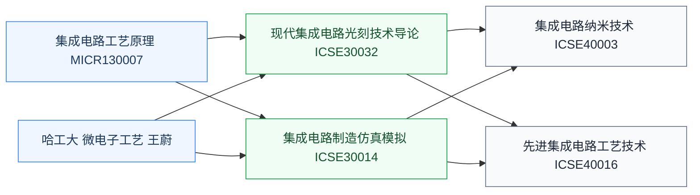

# 集成电路工艺

集成电路工艺研究**把芯片从设计图纸做成硅片的全过程**——光刻、刻蚀、薄膜沉积、离子注入、CMP(化学机械抛光)等微纳加工技术。它是器件设计与电路设计的物理桥梁:工艺决定了器件的尺寸/参数,器件决定了电路的行为。

学好这门课,才能看懂 PDK(Process Design Kit)里的工艺规则文档,理解为什么数字 IC 设计有 DRC(Design Rule Check),以及为什么“7nm/5nm 节点”在工艺界是大事。

## 相关科研方向

- [半导体器件与先进工艺](/guide/ic-guide/%E7%A7%91%E7%A0%94%E6%96%B9%E5%90%91/%E5%8D%8A%E5%AF%BC%E4%BD%93%E5%99%A8%E4%BB%B6%E4%B8%8E%E5%85%88%E8%BF%9B%E5%B7%A5%E8%89%BA)
- [先进封装与异构集成](/guide/ic-guide/%E7%A7%91%E7%A0%94%E6%96%B9%E5%90%91/%E5%85%88%E8%BF%9B%E5%B0%81%E8%A3%85%E4%B8%8E%E5%BC%82%E6%9E%84%E9%9B%86%E6%88%90)
- [MEMS 与微纳传感器](/guide/ic-guide/%E7%A7%91%E7%A0%94%E6%96%B9%E5%90%91/MEMS%E4%B8%8E%E5%BE%AE%E7%BA%B3%E4%BC%A0%E6%84%9F%E5%99%A8)

