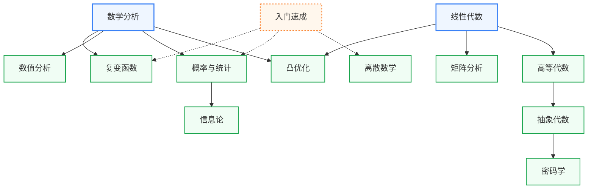

# 数学

## 数学在IC的地位

“吾生也有涯，而知也无涯。”有很多知识是不值得我们“以有涯随无涯”的，但数学绝不在此列。做科研的时候，常常感到万物的尽头就是数学。数学通了什么都通了，绝不存在工科生数学不用那么好的道理，数学底子是多多益善的。以下是我认为对IC至关重要的数学知识：

1. **数学分析**：
   数学分析是现代数学的基石，它涵盖了函数的极限、连续性、导数和积分等概念。该课程奠定了深刻理解物理现象的基础，
2. **线性代数**：
   线性代数在现代数学和应用科学中尤为重要，涵盖了向量空间、线性变换与矩阵理论。通过解决线性方程组，它在计算机图形学、工程优化和数据科学中的信号处理等领域起着核心作用。
3. **概率论**：
   概率论是理解机器学习算法的基础，并用于评价模型预测的准确性，也是当下图像领域主宰——扩散模型（Diffusion Model）的基石。它与信息论结合，分析数据传输的效率，是通信系统及随机信号处理中的关键技术。
4. **信息论**：
   信息论分析数据压缩和传输效率，在深度学习中的信息最大化和集成电路信号处理的功率优化中具有应用价值。与概率论互相支持，信息论提高模型的信息捕获能力。
5. **离散数学**：
   离散数学为算法设计和数据结构提供了理论基础，贯穿图论、逻辑推理，这在AI中的路径规划、搜索算法上尤为重要。
6. **复变函数**：
   复变函数是信号处理及分析复杂频率域信号方面的基础，它在集成电路中用于电路响应分析和滤波设计。
7. **数值分析与数值代数**：
   数值分析解决离散化、误差与稳定性问题，数值代数处理大规模线性方程组、特征值、稀疏矩阵和模型降阶。像 EDA 工具算法、静态时序分析、电路仿真、电磁场求解和热仿真这类真实规模问题，还需要高性能计算（HPC）支撑并行求解。
8. **凸优化**：
   凸优化技术应用于机器学习算法的优化问题，如支持向量机（SVM）和神经网络的参数调优，也为集成电路设计提供了电路性能最大化的路径分析工具。
9. **矩阵分析**：
   很多线性代数课程不涉及矩阵求导，但深度学习中的反向传播会有所涉及，可以看一下矩阵分析快速补课。
10. **高等代数**：
    高等代数提供代数结构的解析工具，支持加密算法和数据编码技术的设计，在信息安全与AI加密模型中发挥重要作用。
11. **抽象代数**：
    密码学的基础。
12. **密码学**：
    密码学为信息安全的基础，通过加密和解密技术保护数据的机密性和完整性。在网络安全和数据隐私方面有重要应用。

## 子目录

- **[入门速成](/guide/ic-guide/%E5%AD%A6%E4%B9%A0%E5%9C%B0%E5%9B%BE/%E6%95%B0%E5%AD%A6/%E5%85%A5%E9%97%A8%E9%80%9F%E6%88%90/index)** — 工程数学及概率方法、CS70、6.042J 等多主题压缩课,数学板块的入口
- **[分析](/guide/ic-guide/%E5%AD%A6%E4%B9%A0%E5%9C%B0%E5%9B%BE/%E6%95%B0%E5%AD%A6/%E5%88%86%E6%9E%90/%E6%95%B0%E5%AD%A6%E5%88%86%E6%9E%90/MIT_18.01-18.02)** — 数学分析、复变函数
- **[代数](/guide/ic-guide/%E5%AD%A6%E4%B9%A0%E5%9C%B0%E5%9B%BE/%E6%95%B0%E5%AD%A6/%E4%BB%A3%E6%95%B0/%E7%BA%BF%E6%80%A7%E4%BB%A3%E6%95%B0/MIT_18.06)** — 线性代数、高等代数、矩阵分析、抽象代数
- **[概率与统计](/guide/ic-guide/%E5%AD%A6%E4%B9%A0%E5%9C%B0%E5%9B%BE/%E6%95%B0%E5%AD%A6/%E6%A6%82%E7%8E%87%E4%B8%8E%E7%BB%9F%E8%AE%A1/ZJU_probability)** — 浙大盛骤体系、Harvard Stat 110、MIT 6.041/6.262
- **[离散数学](/guide/ic-guide/%E5%AD%A6%E4%B9%A0%E5%9C%B0%E5%9B%BE/%E6%95%B0%E5%AD%A6/%E7%A6%BB%E6%95%A3%E6%95%B0%E5%AD%A6/PKU_discrete)** — 北大屈婉玲;图论、组合、数理逻辑
- **[数值与优化](/guide/ic-guide/%E5%AD%A6%E4%B9%A0%E5%9C%B0%E5%9B%BE/%E6%95%B0%E5%AD%A6/%E6%95%B0%E5%80%BC%E4%B8%8E%E4%BC%98%E5%8C%96/%E6%95%B0%E5%80%BC%E5%88%86%E6%9E%90/USTC_numerical)** — 数值分析与数值代数、凸优化
- **[专题](/guide/ic-guide/%E5%AD%A6%E4%B9%A0%E5%9C%B0%E5%9B%BE/%E6%95%B0%E5%AD%A6/%E4%B8%93%E9%A2%98/%E4%BF%A1%E6%81%AF%E8%AE%BA/MacKay_infotheory)** — 信息论、密码学

## 课程关系

箭头从前置课程指向后置课程。数学分析和线性代数是其余所有课程的公共起点。

课程分三条线。分析线从数学分析延伸出复变函数、数值分析、概率与统计，概率与统计再支撑信息论。代数线从线性代数延伸出矩阵分析和高等代数，高等代数经抽象代数通向密码学。凸优化同时依赖数学分析和线性代数。离散数学不依赖分析与代数，可以直接学。入门速成是多主题压缩课，虚线指向它能替代入门的三门课。

## 相关科研方向

| 数学子分支 | 主要服务的科研方向 |
|---|---|
| 数学分析 + 线性代数 | 所有方向(基础) |
| 复变函数 + 信号处理基础 | [模拟与混合信号 IC](/guide/ic-guide/%E7%A7%91%E7%A0%94%E6%96%B9%E5%90%91/%E6%A8%A1%E6%8B%9F%E4%B8%8E%E6%B7%B7%E5%90%88%E4%BF%A1%E5%8F%B7IC)、[射频与毫米波 IC](/guide/ic-guide/%E7%A7%91%E7%A0%94%E6%96%B9%E5%90%91/%E5%B0%84%E9%A2%91%E4%B8%8E%E6%AF%AB%E7%B1%B3%E6%B3%A2IC) |
| 概率论 + 信息论 | [AI 算法与系统](/guide/ic-guide/%E7%A7%91%E7%A0%94%E6%96%B9%E5%90%91/AI%E7%AE%97%E6%B3%95%E4%B8%8E%E7%B3%BB%E7%BB%9F)、[硬件安全与可信计算](/guide/ic-guide/%E7%A7%91%E7%A0%94%E6%96%B9%E5%90%91/%E7%A1%AC%E4%BB%B6%E5%AE%89%E5%85%A8%E4%B8%8E%E5%8F%AF%E4%BF%A1%E8%AE%A1%E7%AE%97) |
| 矩阵分析 + 凸优化 | [AI 算法与系统](/guide/ic-guide/%E7%A7%91%E7%A0%94%E6%96%B9%E5%90%91/AI%E7%AE%97%E6%B3%95%E4%B8%8E%E7%B3%BB%E7%BB%9F)、[EDA 与设计自动化](/guide/ic-guide/%E7%A7%91%E7%A0%94%E6%96%B9%E5%90%91/EDA%E4%B8%8E%E8%AE%BE%E8%AE%A1%E8%87%AA%E5%8A%A8%E5%8C%96)(布局布线优化) |
| 离散数学 + 图论 | [EDA 与设计自动化](/guide/ic-guide/%E7%A7%91%E7%A0%94%E6%96%B9%E5%90%91/EDA%E4%B8%8E%E8%AE%BE%E8%AE%A1%E8%87%AA%E5%8A%A8%E5%8C%96)、[处理器架构与编译系统](/guide/ic-guide/%E7%A7%91%E7%A0%94%E6%96%B9%E5%90%91/%E5%A4%84%E7%90%86%E5%99%A8%E6%9E%B6%E6%9E%84%E4%B8%8E%E7%BC%96%E8%AF%91%E7%B3%BB%E7%BB%9F) |
| 数值分析 + 数值代数（HPC 支撑） | 所有需要“仿真”和大规模矩阵求解的方向(EDA/电磁/电路/MEMS) |
| 抽象代数 + 密码学 | [硬件安全与可信计算](/guide/ic-guide/%E7%A7%91%E7%A0%94%E6%96%B9%E5%90%91/%E7%A1%AC%E4%BB%B6%E5%AE%89%E5%85%A8%E4%B8%8E%E5%8F%AF%E4%BF%A1%E8%AE%A1%E7%AE%97) |
| 量子物理(非数学但相关) | [量子计算与量子芯片](/guide/ic-guide/%E7%A7%91%E7%A0%94%E6%96%B9%E5%90%91/%E9%87%8F%E5%AD%90%E8%AE%A1%E7%AE%97%E4%B8%8E%E9%87%8F%E5%AD%90%E8%8A%AF%E7%89%87) |
