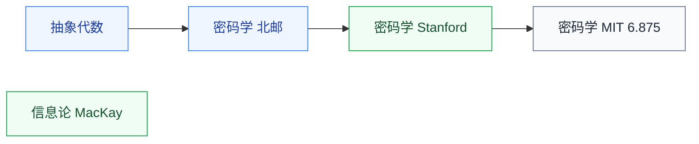

# 专题

服务特定方向的两门专题数学,按需选学。

## 子目录

- **[信息论](/guide/ic-guide/%E5%AD%A6%E4%B9%A0%E5%9C%B0%E5%9B%BE/%E6%95%B0%E5%AD%A6/%E4%B8%93%E9%A2%98/%E4%BF%A1%E6%81%AF%E8%AE%BA/MacKay_infotheory)** — MacKay;数据压缩、信道容量;通信、ML、安全的交叉基础
- **[密码学](/guide/ic-guide/%E5%AD%A6%E4%B9%A0%E5%9C%B0%E5%9B%BE/%E6%95%B0%E5%AD%A6/%E4%B8%93%E9%A2%98/%E5%AF%86%E7%A0%81%E5%AD%A6/BUPT_crypto)** — 北邮、MIT 6.875、Stanford(Boneh);硬件安全方向直接相关,先修[抽象代数](/guide/ic-guide/%E5%AD%A6%E4%B9%A0%E5%9C%B0%E5%9B%BE/%E6%95%B0%E5%AD%A6/%E4%BB%A3%E6%95%B0/%E6%8A%BD%E8%B1%A1%E4%BB%A3%E6%95%B0/NJU_sunzhiwei)

## 相关科研方向

- [硬件安全与可信计算](/guide/ic-guide/%E7%A7%91%E7%A0%94%E6%96%B9%E5%90%91/%E7%A1%AC%E4%BB%B6%E5%AE%89%E5%85%A8%E4%B8%8E%E5%8F%AF%E4%BF%A1%E8%AE%A1%E7%AE%97)
- [AI 算法与系统](/guide/ic-guide/%E7%A7%91%E7%A0%94%E6%96%B9%E5%90%91/AI%E7%AE%97%E6%B3%95%E4%B8%8E%E7%B3%BB%E7%BB%9F)

