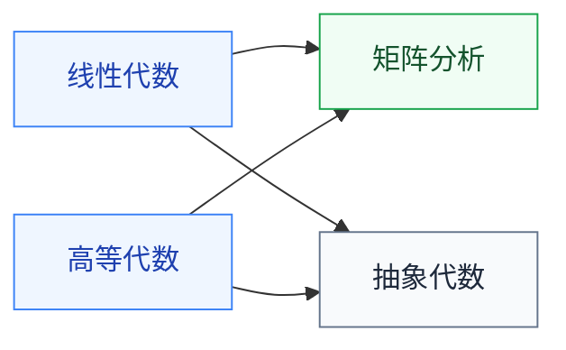

# 代数

线性代数是 ML、EDA、信号处理的共同语言,必学。其余三门按方向选学。

## 子目录

- **[线性代数](/guide/ic-guide/%E5%AD%A6%E4%B9%A0%E5%9C%B0%E5%9B%BE/%E6%95%B0%E5%AD%A6/%E4%BB%A3%E6%95%B0/%E7%BA%BF%E6%80%A7%E4%BB%A3%E6%95%B0/MIT_18.06)** — 复旦、MIT 18.06(Gilbert Strang);向量空间、特征值、SVD
- **[高等代数](/guide/ic-guide/%E5%AD%A6%E4%B9%A0%E5%9C%B0%E5%9B%BE/%E6%95%B0%E5%AD%A6/%E4%BB%A3%E6%95%B0/%E9%AB%98%E7%AD%89%E4%BB%A3%E6%95%B0/PKU_qiuweisheng)** — 北大丘维声、Axler 官方视频;比线代严谨,适合理论路线
- **[矩阵分析](/guide/ic-guide/%E5%AD%A6%E4%B9%A0%E5%9C%B0%E5%9B%BE/%E6%95%B0%E5%AD%A6/%E4%BB%A3%E6%95%B0/%E7%9F%A9%E9%98%B5%E5%88%86%E6%9E%90/MIT_18.065)** — MIT 18.065、哈工大严质彬;矩阵求导与分解,深度学习反向传播会用到
- **[抽象代数](/guide/ic-guide/%E5%AD%A6%E4%B9%A0%E5%9C%B0%E5%9B%BE/%E6%95%B0%E5%AD%A6/%E4%BB%A3%E6%95%B0/%E6%8A%BD%E8%B1%A1%E4%BB%A3%E6%95%B0/NJU_sunzhiwei)** — 南大孙智伟、Harvard(Gross);密码学的前置

## 相关科研方向

- [AI 算法与系统](/guide/ic-guide/%E7%A7%91%E7%A0%94%E6%96%B9%E5%90%91/AI%E7%AE%97%E6%B3%95%E4%B8%8E%E7%B3%BB%E7%BB%9F)
- [EDA 与设计自动化](/guide/ic-guide/%E7%A7%91%E7%A0%94%E6%96%B9%E5%90%91/EDA%E4%B8%8E%E8%AE%BE%E8%AE%A1%E8%87%AA%E5%8A%A8%E5%8C%96)
- [硬件安全与可信计算](/guide/ic-guide/%E7%A7%91%E7%A0%94%E6%96%B9%E5%90%91/%E7%A1%AC%E4%BB%B6%E5%AE%89%E5%85%A8%E4%B8%8E%E5%8F%AF%E4%BF%A1%E8%AE%A1%E7%AE%97)

