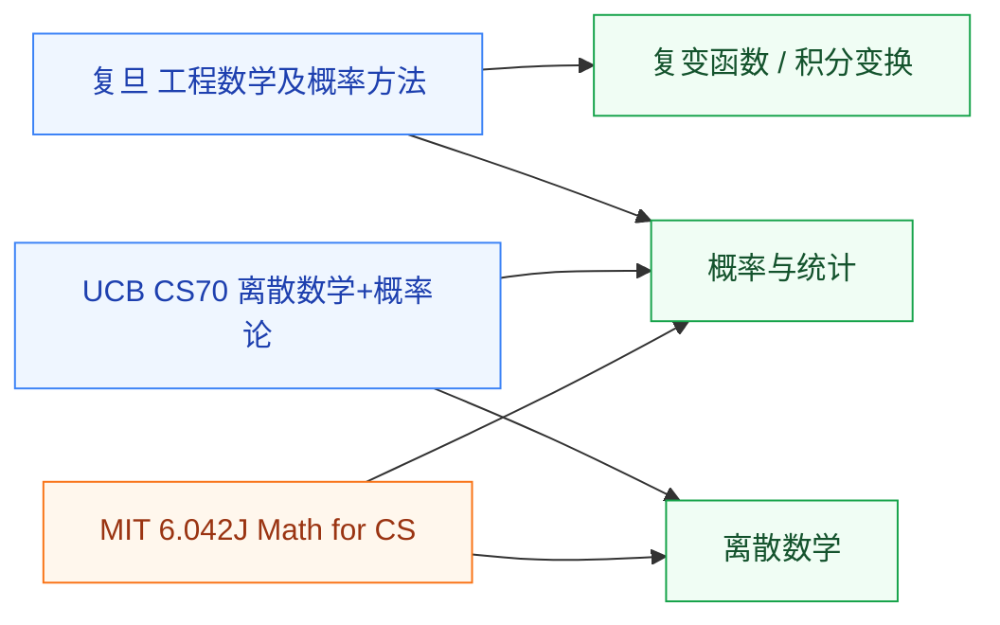

# 入门速成

这里的课是多主题压缩课。学校开给工科生,目标是快速掌握公式和结论到能用的程度,而不是逐个主题从头建体系。把它们塞进任何单主题目录都只对一半,所以单独成组,放在数学板块的入口位置。先用速成课把要用的数学过一遍,之后哪一块不够,再去对应的主题目录深入。

## 课程与覆盖范围

- **[工程数学及概率方法(复旦)](/guide/ic-guide/%E5%AD%A6%E4%B9%A0%E5%9C%B0%E5%9B%BE/%E6%95%B0%E5%AD%A6/%E5%85%A5%E9%97%A8%E9%80%9F%E6%88%90/FDU_MICR130008)** — 复变函数、积分变换、概率论的工程子集;深入对应[分析/复变函数](/guide/ic-guide/%E5%AD%A6%E4%B9%A0%E5%9C%B0%E5%9B%BE/%E6%95%B0%E5%AD%A6/%E5%88%86%E6%9E%90/%E5%A4%8D%E5%8F%98%E5%87%BD%E6%95%B0/XJTU_complex)和[概率与统计](/guide/ic-guide/%E5%AD%A6%E4%B9%A0%E5%9C%B0%E5%9B%BE/%E6%95%B0%E5%AD%A6/%E6%A6%82%E7%8E%87%E4%B8%8E%E7%BB%9F%E8%AE%A1/ZJU_probability)
- **[UCB CS70: Discrete Math and Probability Theory](/guide/ic-guide/%E5%AD%A6%E4%B9%A0%E5%9C%B0%E5%9B%BE/%E6%95%B0%E5%AD%A6/%E5%85%A5%E9%97%A8%E9%80%9F%E6%88%90/UCB_CS70)** — 离散数学 + 概率论,每个模块都对应实际算法;深入对应[离散数学](/guide/ic-guide/%E5%AD%A6%E4%B9%A0%E5%9C%B0%E5%9B%BE/%E6%95%B0%E5%AD%A6/%E7%A6%BB%E6%95%A3%E6%95%B0%E5%AD%A6/PKU_discrete)和[概率与统计](/guide/ic-guide/%E5%AD%A6%E4%B9%A0%E5%9C%B0%E5%9B%BE/%E6%95%B0%E5%AD%A6/%E6%A6%82%E7%8E%87%E4%B8%8E%E7%BB%9F%E8%AE%A1/ZJU_probability)
- **[MIT 6.042J: Mathematics for Computer Science](/guide/ic-guide/%E5%AD%A6%E4%B9%A0%E5%9C%B0%E5%9B%BE/%E6%95%B0%E5%AD%A6/%E5%85%A5%E9%97%A8%E9%80%9F%E6%88%90/MIT_6.042J)** — 同样是离散 + 概率的“math for CS”路线,与 CS70 二选一

## 怎么选

- 在复旦按培养方案走,工程数学及概率方法是必经的一门,这里给出配套资料。
- 偏算法/EDA/体系结构方向,想快速补离散和概率,CS70 与 6.042J 二选一。
- 不赶进度、想把某一块学透,直接去对应主题目录,不必先过速成课。
