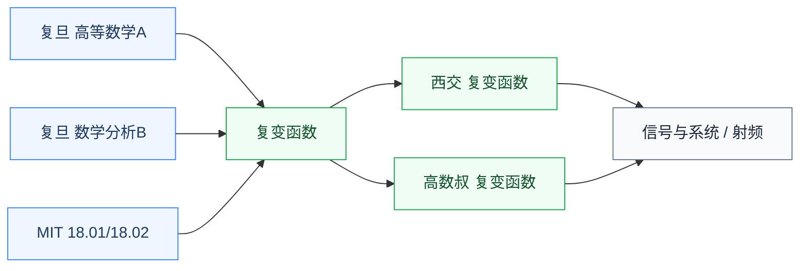

# 分析

分析线处理连续量。数学分析是全部理工课程的地基,复变函数把分析延伸到复平面,是频域方法的数学来源。

## 子目录

- **[数学分析](/guide/ic-guide/%E5%AD%A6%E4%B9%A0%E5%9C%B0%E5%9B%BE/%E6%95%B0%E5%AD%A6/%E5%88%86%E6%9E%90/%E6%95%B0%E5%AD%A6%E5%88%86%E6%9E%90/FDU_MATH120016-17)** — 复旦(谢锡麟/陈纪修任选)、MIT 18.01/18.02;所有后续课程的起点
- **[复变函数](/guide/ic-guide/%E5%AD%A6%E4%B9%A0%E5%9C%B0%E5%9B%BE/%E6%95%B0%E5%AD%A6/%E5%88%86%E6%9E%90/%E5%A4%8D%E5%8F%98%E5%87%BD%E6%95%B0/XJTU_complex)** — 西交、高数叔;拉普拉斯变换和频域分析的数学基础,信号与系统、射频的前置

## 相关科研方向

- [模拟与混合信号 IC](/guide/ic-guide/%E7%A7%91%E7%A0%94%E6%96%B9%E5%90%91/%E6%A8%A1%E6%8B%9F%E4%B8%8E%E6%B7%B7%E5%90%88%E4%BF%A1%E5%8F%B7IC)
- [射频与毫米波 IC](/guide/ic-guide/%E7%A7%91%E7%A0%94%E6%96%B9%E5%90%91/%E5%B0%84%E9%A2%91%E4%B8%8E%E6%AF%AB%E7%B1%B3%E6%B3%A2IC)

