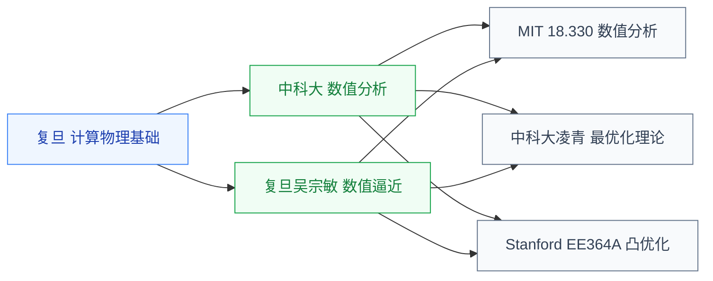

# 数值与优化

计算机里“解数学”的核心板块。数值分析管算得准、算得稳，数值代数管大规模线性系统和稀疏矩阵怎么解，凸优化管找最优。问题规模真正上来以后，还要接上高性能计算（HPC）和并行求解。

## 子目录

- **[数值分析](/guide/ic-guide/%E5%AD%A6%E4%B9%A0%E5%9C%B0%E5%9B%BE/%E6%95%B0%E5%AD%A6/%E6%95%B0%E5%80%BC%E4%B8%8E%E4%BC%98%E5%8C%96/%E6%95%B0%E5%80%BC%E5%88%86%E6%9E%90/USTC_numerical)** — 复旦吴宗敏、中科大、MIT 18.330;EDA 求解器、SPICE 仿真和数值代数的算法基础
- **[凸优化](/guide/ic-guide/%E5%AD%A6%E4%B9%A0%E5%9C%B0%E5%9B%BE/%E6%95%B0%E5%AD%A6/%E6%95%B0%E5%80%BC%E4%B8%8E%E4%BC%98%E5%8C%96/%E5%87%B8%E4%BC%98%E5%8C%96/Stanford_EE364A)** — 中科大凌青、Stanford EE364A(Boyd);ML 与 EDA 布局优化的核心工具

HPC 本身更接近系统架构能力，但在 EDA 科学计算里常和数值算法绑在一起：稀疏矩阵、迭代求解、预条件、GPU/多核并行和任务调度，决定了仿真器和求解器能否处理真实规模问题。

## 相关科研方向

- [EDA 与设计自动化](/guide/ic-guide/%E7%A7%91%E7%A0%94%E6%96%B9%E5%90%91/EDA%E4%B8%8E%E8%AE%BE%E8%AE%A1%E8%87%AA%E5%8A%A8%E5%8C%96)
- [AI 算法与系统](/guide/ic-guide/%E7%A7%91%E7%A0%94%E6%96%B9%E5%90%91/AI%E7%AE%97%E6%B3%95%E4%B8%8E%E7%B3%BB%E7%BB%9F)
