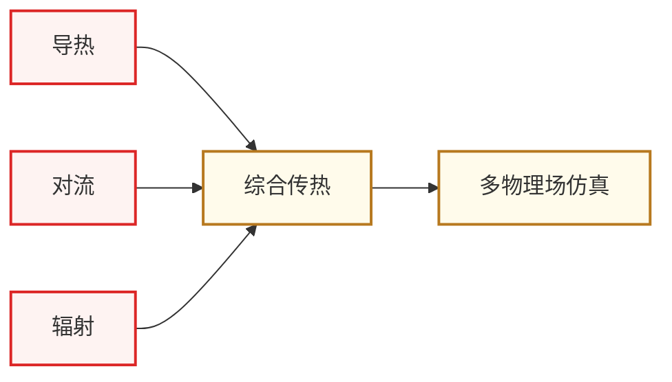

# 传热学

传热学(Heat Transfer)研究**热量在材料中的传递规律**——导热、对流、辐射三种方式。对 IC 学生来说,它服务于两个具体方向:

- **[先进封装与异构集成](/guide/ic-guide/%E7%A7%91%E7%A0%94%E6%96%B9%E5%90%91/%E5%85%88%E8%BF%9B%E5%B0%81%E8%A3%85%E4%B8%8E%E5%BC%82%E6%9E%84%E9%9B%86%E6%88%90)** — 2.5D/3D 集成芯片的热流分析、热阻设计、热岛问题
- **[功率半导体与宽禁带器件](/guide/ic-guide/%E7%A7%91%E7%A0%94%E6%96%B9%E5%90%91/%E5%8A%9F%E7%8E%87%E5%8D%8A%E5%AF%BC%E4%BD%93%E4%B8%8E%E5%AE%BD%E7%A6%81%E5%B8%A6%E5%99%A8%E4%BB%B6)** — SiC/GaN 功率器件的散热设计、热-电协同仿真

随着芯片功率密度逼近物理极限,**“热”已经成为继性能、功耗后的第三个一阶设计约束**。Chiplet/HBM 堆叠之后,芯片热设计与电气设计的耦合越来越深,做这两个方向的同学绕不开传热学。

## 知识谱系

主链 **三种传热模式 → 综合工程问题 → 多物理场仿真**。前面是物理基础,后面是 IC 工程应用。

## 相关科研方向

- [先进封装与异构集成](/guide/ic-guide/%E7%A7%91%E7%A0%94%E6%96%B9%E5%90%91/%E5%85%88%E8%BF%9B%E5%B0%81%E8%A3%85%E4%B8%8E%E5%BC%82%E6%9E%84%E9%9B%86%E6%88%90)
- [功率半导体与宽禁带器件](/guide/ic-guide/%E7%A7%91%E7%A0%94%E6%96%B9%E5%90%91/%E5%8A%9F%E7%8E%87%E5%8D%8A%E5%AF%BC%E4%BD%93%E4%B8%8E%E5%AE%BD%E7%A6%81%E5%B8%A6%E5%99%A8%E4%BB%B6)
- [MEMS 与微纳传感器](/guide/ic-guide/%E7%A7%91%E7%A0%94%E6%96%B9%E5%90%91/MEMS%E4%B8%8E%E5%BE%AE%E7%BA%B3%E4%BC%A0%E6%84%9F%E5%99%A8)

