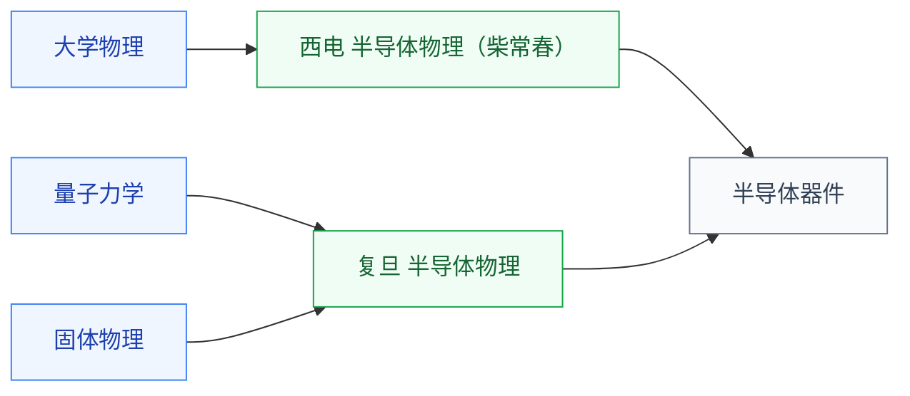

# 半导体物理

半导体物理把**固体物理的能带理论应用在半导体材料(主要是硅)上**,并引入“载流子统计、漂移与扩散、PN 结、欧姆与肖特基接触”等核心概念。这是**所有半导体器件设计的物理基础**——不懂半导体物理,就读不懂晶体管的 SPICE 模型参数,也理解不了为什么 FinFET 比平面 MOSFET 漏电更小。

对 IC 学生来说,半导体物理是从“通识物理”过渡到“工程器件物理”的最后一步,接下来就直接进入 [半导体器件](/guide/ic-guide/%E5%AD%A6%E4%B9%A0%E5%9C%B0%E5%9B%BE/%E5%99%A8%E4%BB%B6%E4%B8%8E%E5%B7%A5%E8%89%BA/%E5%8D%8A%E5%AF%BC%E4%BD%93%E5%99%A8%E4%BB%B6/index) 课程链。

## 相关科研方向

- [器件与工艺](/guide/ic-guide/%E5%AD%A6%E4%B9%A0%E5%9C%B0%E5%9B%BE/%E5%99%A8%E4%BB%B6%E4%B8%8E%E5%B7%A5%E8%89%BA/index)
- [半导体器件与先进工艺](/guide/ic-guide/%E7%A7%91%E7%A0%94%E6%96%B9%E5%90%91/%E5%8D%8A%E5%AF%BC%E4%BD%93%E5%99%A8%E4%BB%B6%E4%B8%8E%E5%85%88%E8%BF%9B%E5%B7%A5%E8%89%BA)
- [功率半导体与宽禁带器件](/guide/ic-guide/%E7%A7%91%E7%A0%94%E6%96%B9%E5%90%91/%E5%8A%9F%E7%8E%87%E5%8D%8A%E5%AF%BC%E4%BD%93%E4%B8%8E%E5%AE%BD%E7%A6%81%E5%B8%A6%E5%99%A8%E4%BB%B6)
- [光电子与硅光集成](/guide/ic-guide/%E7%A7%91%E7%A0%94%E6%96%B9%E5%90%91/%E5%85%89%E7%94%B5%E5%AD%90%E4%B8%8E%E7%A1%85%E5%85%89%E9%9B%86%E6%88%90)
- [模拟与混合信号 IC](/guide/ic-guide/%E7%A7%91%E7%A0%94%E6%96%B9%E5%90%91/%E6%A8%A1%E6%8B%9F%E4%B8%8E%E6%B7%B7%E5%90%88%E4%BF%A1%E5%8F%B7IC)

