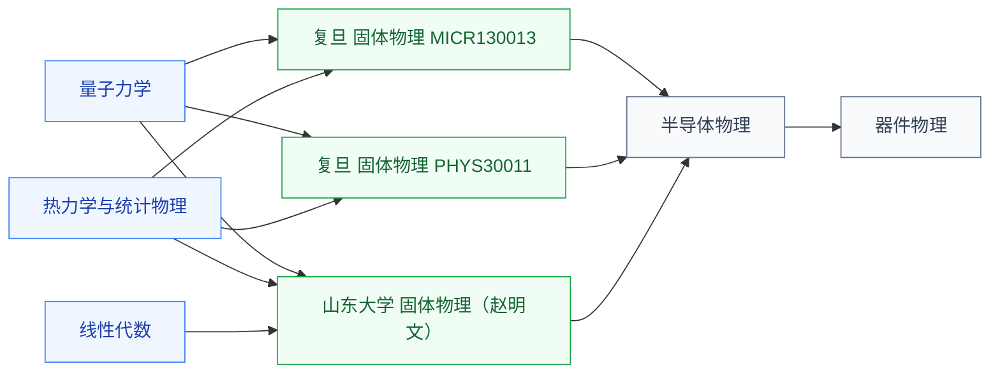

# 固体物理

固体物理研究**晶体中电子和声子的行为**——晶格振动、电子能带、布里渊区、输运现象。它在物理知识链上**承上启下**:上承量子力学(把单电子薛定谔方程推广到周期势阱中的多体系统),下启半导体物理(直接给出“能带”这一半导体器件的核心概念)。

IC 学生如果想做器件、工艺、光电子方向,**绕不开固体物理**——看到的 N 型/P 型掺杂、PN 结、肖特基势垒,本质都是固体物理在半导体材料上的具体应用。

## 相关科研方向

- [半导体器件与先进工艺](/guide/ic-guide/%E7%A7%91%E7%A0%94%E6%96%B9%E5%90%91/%E5%8D%8A%E5%AF%BC%E4%BD%93%E5%99%A8%E4%BB%B6%E4%B8%8E%E5%85%88%E8%BF%9B%E5%B7%A5%E8%89%BA)
- [功率半导体与宽禁带器件](/guide/ic-guide/%E7%A7%91%E7%A0%94%E6%96%B9%E5%90%91/%E5%8A%9F%E7%8E%87%E5%8D%8A%E5%AF%BC%E4%BD%93%E4%B8%8E%E5%AE%BD%E7%A6%81%E5%B8%A6%E5%99%A8%E4%BB%B6)
- [光电子与硅光集成](/guide/ic-guide/%E7%A7%91%E7%A0%94%E6%96%B9%E5%90%91/%E5%85%89%E7%94%B5%E5%AD%90%E4%B8%8E%E7%A1%85%E5%85%89%E9%9B%86%E6%88%90)

