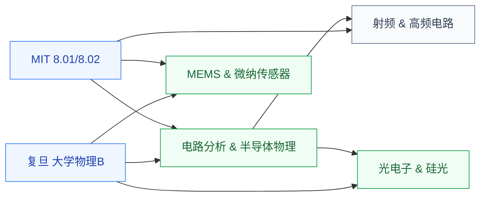

# 大学物理

大学物理(力学 + 电磁学 + 光学 + 热力学)是所有理工科本科生的共同物理基础。对 IC 学生来说,大物的**电磁学章节**最直接相关——它是后续学习电路分析、信号传输、射频天线、半导体物理的物理底子;**光学章节**则是进入光电子/硅光方向的入门。

## 相关科研方向

- [具身智能](/guide/ic-guide/%E7%A7%91%E7%A0%94%E6%96%B9%E5%90%91/%E5%85%B7%E8%BA%AB%E6%99%BA%E8%83%BD)
- [MEMS 与微纳传感器](/guide/ic-guide/%E7%A7%91%E7%A0%94%E6%96%B9%E5%90%91/MEMS%E4%B8%8E%E5%BE%AE%E7%BA%B3%E4%BC%A0%E6%84%9F%E5%99%A8)
- [射频与毫米波 IC](/guide/ic-guide/%E7%A7%91%E7%A0%94%E6%96%B9%E5%90%91/%E5%B0%84%E9%A2%91%E4%B8%8E%E6%AF%AB%E7%B1%B3%E6%B3%A2IC)
- [光电子与硅光集成](/guide/ic-guide/%E7%A7%91%E7%A0%94%E6%96%B9%E5%90%91/%E5%85%89%E7%94%B5%E5%AD%90%E4%B8%8E%E7%A1%85%E5%85%89%E9%9B%86%E6%88%90)
- [先进封装与异构集成](/guide/ic-guide/%E7%A7%91%E7%A0%94%E6%96%B9%E5%90%91/%E5%85%88%E8%BF%9B%E5%B0%81%E8%A3%85%E4%B8%8E%E5%BC%82%E6%9E%84%E9%9B%86%E6%88%90)

