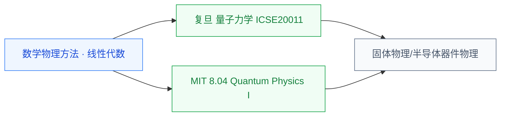

# 量子力学

量子力学是 20 世纪物理学的两大支柱之一(另一个是相对论),研究微观粒子(电子、原子、分子)的运动规律。对 IC 学生来说,**没有量子力学就读不懂半导体物理**——能带、隧穿、激子、自旋等概念全部建立在量子力学之上。如果有意做器件、量子计算或硅光方向,量子力学是必须啃下的物理基础。

## 相关科研方向

- [半导体器件与先进工艺](/guide/ic-guide/%E7%A7%91%E7%A0%94%E6%96%B9%E5%90%91/%E5%8D%8A%E5%AF%BC%E4%BD%93%E5%99%A8%E4%BB%B6%E4%B8%8E%E5%85%88%E8%BF%9B%E5%B7%A5%E8%89%BA)
- [功率半导体与宽禁带器件](/guide/ic-guide/%E7%A7%91%E7%A0%94%E6%96%B9%E5%90%91/%E5%8A%9F%E7%8E%87%E5%8D%8A%E5%AF%BC%E4%BD%93%E4%B8%8E%E5%AE%BD%E7%A6%81%E5%B8%A6%E5%99%A8%E4%BB%B6)
- [量子计算与量子芯片](/guide/ic-guide/%E7%A7%91%E7%A0%94%E6%96%B9%E5%90%91/%E9%87%8F%E5%AD%90%E8%AE%A1%E7%AE%97%E4%B8%8E%E9%87%8F%E5%AD%90%E8%8A%AF%E7%89%87)
- [光电子与硅光集成](/guide/ic-guide/%E7%A7%91%E7%A0%94%E6%96%B9%E5%90%91/%E5%85%89%E7%94%B5%E5%AD%90%E4%B8%8E%E7%A1%85%E5%85%89%E9%9B%86%E6%88%90)

