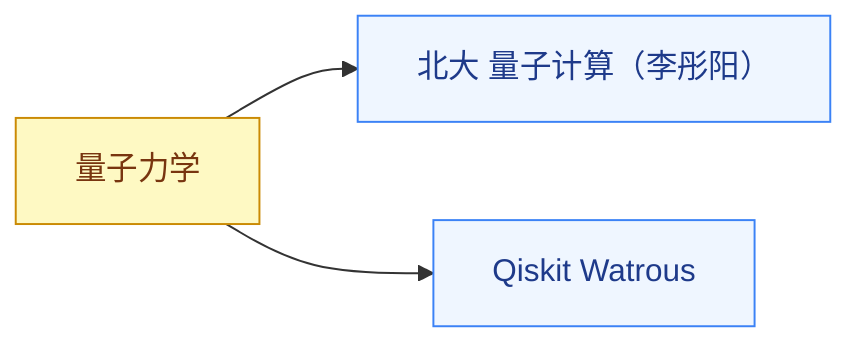

# 量子计算

前置是[量子力学](/guide/ic-guide/%E5%AD%A6%E4%B9%A0%E5%9C%B0%E5%9B%BE/%E7%89%A9%E7%90%86/%E9%87%8F%E5%AD%90%E5%8A%9B%E5%AD%A6/index),至少学到会用 Dirac 记号做计算。两门课一中一英,一个建算法框架,一个带代码实操。

## 相关科研方向

[量子计算与量子芯片](/guide/ic-guide/%E7%A7%91%E7%A0%94%E6%96%B9%E5%90%91/%E9%87%8F%E5%AD%90%E8%AE%A1%E7%AE%97%E4%B8%8E%E9%87%8F%E5%AD%90%E8%8A%AF%E7%89%87)

