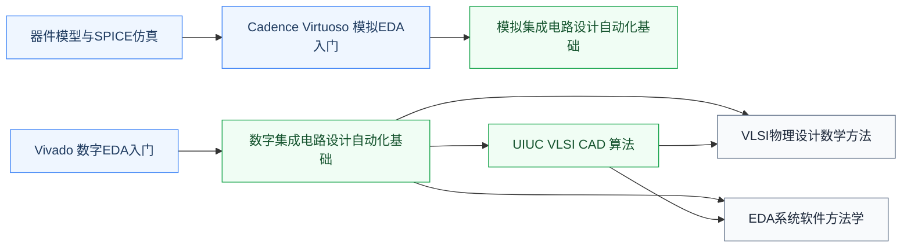

# EDA 工具

EDA(Electronic Design Automation)指**用于设计、仿真、验证、流片芯片的软件工具**。从 RTL 综合到布局布线、从模拟仿真到版图设计,所有 IC 设计的“工程产出”都借助 EDA 工具完成。Cadence、Synopsys、Siemens EDA 三家垄断了商业 EDA 市场,合称“EDA 三巨头”。

## 课程与工具

- **复旦 2025 培养方案课程**:[VLSI物理设计数学方法](/guide/ic-guide/%E5%AD%A6%E4%B9%A0%E5%9C%B0%E5%9B%BE/%E7%94%B5%E8%B7%AF/EDA/FDU_ICSE30026)；占位骨架（欢迎补全）:[数字EDA基础](/guide/ic-guide/%E5%AD%A6%E4%B9%A0%E5%9C%B0%E5%9B%BE/%E7%94%B5%E8%B7%AF/EDA/FDU_ICSE30019) · [模拟EDA基础](/guide/ic-guide/%E5%AD%A6%E4%B9%A0%E5%9C%B0%E5%9B%BE/%E7%94%B5%E8%B7%AF/EDA/FDU_ICSE30018) · [EDA系统软件方法学](/guide/ic-guide/%E5%AD%A6%E4%B9%A0%E5%9C%B0%E5%9B%BE/%E7%94%B5%E8%B7%AF/EDA/FDU_ICSE30028)；AI for EDA 课程见[人工智能/AI交叉应用](/guide/ic-guide/%E5%AD%A6%E4%B9%A0%E5%9C%B0%E5%9B%BE/%E4%BA%BA%E5%B7%A5%E6%99%BA%E8%83%BD/AI%E4%BA%A4%E5%8F%89%E5%BA%94%E7%94%A8/FDU_ICSE40019)
- **[Vivado 入门](/guide/ic-guide/%E5%AD%A6%E4%B9%A0%E5%9C%B0%E5%9B%BE/%E7%94%B5%E8%B7%AF/EDA/vivado)** — AMD/Xilinx FPGA EDA 工具入口
- **[Cadence Virtuoso 入门](/guide/ic-guide/%E5%AD%A6%E4%B9%A0%E5%9C%B0%E5%9B%BE/%E7%94%B5%E8%B7%AF/EDA/cadence)** — 模拟 IC 设计工业标准
- **[UIUC VLSI CAD (Coursera)](/guide/ic-guide/%E5%AD%A6%E4%B9%A0%E5%9C%B0%E5%9B%BE/%E7%94%B5%E8%B7%AF/EDA/UIUC_VLSI_CAD)** — 讲 EDA 工具背后的算法:逻辑综合、布局布线、时序分析

!!! note "算法前置说明"
    学习 UIUC VLSI CAD 前，建议先掌握基本图算法。EDA 中的静态时序分析（STA）本质是 DAG 最长路问题，布线依赖最短路与最大流/最小割，布局则涉及图划分。这些内容在[数据结构与算法](/guide/ic-guide/%E5%AD%A6%E4%B9%A0%E5%9C%B0%E5%9B%BE/%E7%AE%97%E6%B3%95%E7%BC%96%E7%A8%8B/%E6%95%B0%E6%8D%AE%E7%BB%93%E6%9E%84%E4%B8%8E%E7%AE%97%E6%B3%95/index)板块均有覆盖，重点见 CS170 和 MIT 6.006。

## 相关科研方向

[EDA 与设计自动化](/guide/ic-guide/%E7%A7%91%E7%A0%94%E6%96%B9%E5%90%91/EDA%E4%B8%8E%E8%AE%BE%E8%AE%A1%E8%87%AA%E5%8A%A8%E5%8C%96)

