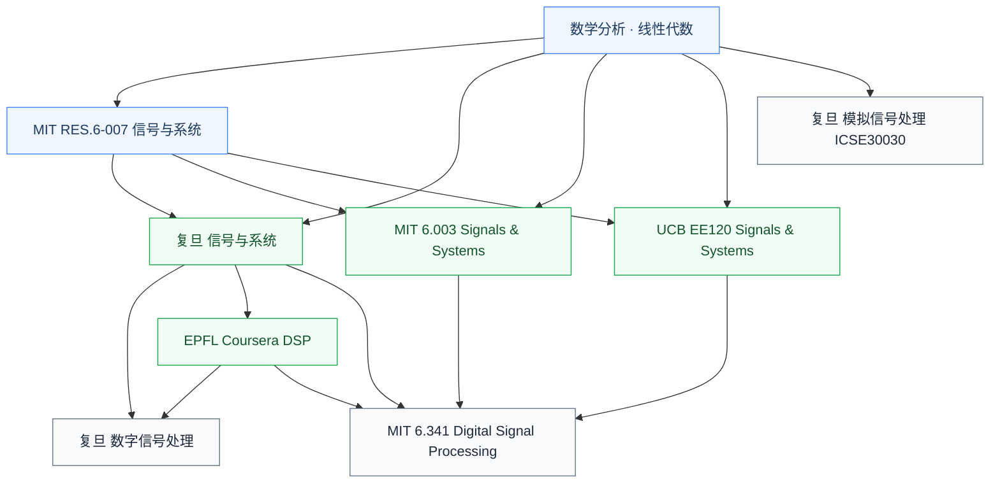

# 信号处理

信号处理研究**信号的数学表示和系统对其响应**——傅里叶变换、拉普拉斯变换、Z 变换、滤波、采样定理。它是通信、雷达、生物医学、音频/图像处理的共同数学基础,也是 ADC/DAC、DSP 等具体模块的理论支撑。

## 子目录

- **[信号与系统](/guide/ic-guide/%E5%AD%A6%E4%B9%A0%E5%9C%B0%E5%9B%BE/%E7%94%B5%E8%B7%AF/%E4%BF%A1%E5%8F%B7%E5%A4%84%E7%90%86/%E4%BF%A1%E5%8F%B7%E4%B8%8E%E7%B3%BB%E7%BB%9F/FDU_MICR130004)** — 数学基础:连续/离散信号、卷积、各种变换
- **[数字信号处理 (DSP)](/guide/ic-guide/%E5%AD%A6%E4%B9%A0%E5%9C%B0%E5%9B%BE/%E7%94%B5%E8%B7%AF/%E4%BF%A1%E5%8F%B7%E5%A4%84%E7%90%86/%E6%95%B0%E5%AD%97%E4%BF%A1%E5%8F%B7%E5%A4%84%E7%90%86/FDU_INFO130010)** — 用计算机或专用硬件做实际信号处理

ADC/DAC 数据转换器先修是模拟集成电路,已归入[模拟与射频](/guide/ic-guide/%E5%AD%A6%E4%B9%A0%E5%9C%B0%E5%9B%BE/%E7%94%B5%E8%B7%AF/%E6%A8%A1%E6%8B%9F%E4%B8%8E%E5%B0%84%E9%A2%91/%E6%95%B0%E6%A8%A1%E6%A8%A1%E6%95%B0%E8%BD%AC%E6%8D%A2%E5%99%A8/FDU_INFO130270);MATLAB 是工具而非课程主线,已归入[工程工具](/guide/ic-guide/%E5%B7%A5%E7%A8%8B%E5%B7%A5%E5%85%B7/%E7%A7%91%E5%AD%A6%E8%AE%A1%E7%AE%97)。

## 相关科研方向

- [模拟与混合信号 IC](/guide/ic-guide/%E7%A7%91%E7%A0%94%E6%96%B9%E5%90%91/%E6%A8%A1%E6%8B%9F%E4%B8%8E%E6%B7%B7%E5%90%88%E4%BF%A1%E5%8F%B7IC)
- [生物电子与脑机接口](/guide/ic-guide/%E7%A7%91%E7%A0%94%E6%96%B9%E5%90%91/%E7%94%9F%E7%89%A9%E7%94%B5%E5%AD%90%E4%B8%8E%E8%84%91%E6%9C%BA%E6%8E%A5%E5%8F%A3)
- [射频与毫米波 IC](/guide/ic-guide/%E7%A7%91%E7%A0%94%E6%96%B9%E5%90%91/%E5%B0%84%E9%A2%91%E4%B8%8E%E6%AF%AB%E7%B1%B3%E6%B3%A2IC)

