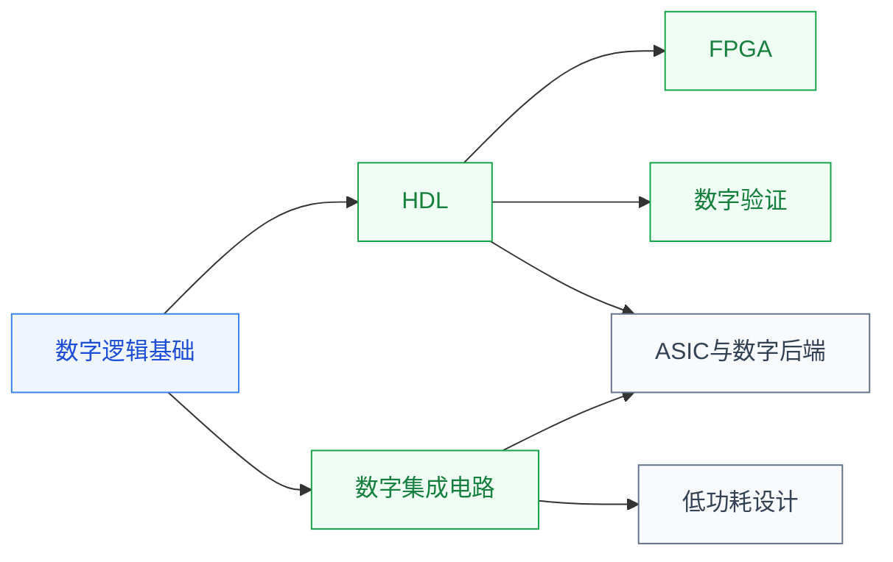

# 数字设计

数字电路处理**离散二进制信号(0 和 1)**:从最基础的逻辑门(与/或/非)、组合逻辑(加法器),到时序逻辑(触发器、状态机),再到把这些组合起来形成处理器、存储器、加速器等大型数字系统。它是所有数字芯片(CPU/GPU/FPGA/ASIC)的基础。本目录覆盖数字设计的完整链条,从逻辑门一路走到 GDSII。

## 子目录

- **[数字逻辑基础](/guide/ic-guide/%E5%AD%A6%E4%B9%A0%E5%9C%B0%E5%9B%BE/%E7%94%B5%E8%B7%AF/%E6%95%B0%E5%AD%97%E8%AE%BE%E8%AE%A1/%E6%95%B0%E5%AD%97%E9%80%BB%E8%BE%91%E5%9F%BA%E7%A1%80/FDU_MICR130003)** — 数电入门:逻辑门、布尔代数、组合/时序电路、状态机
- **[硬件描述语言 (HDL)](/guide/ic-guide/%E5%AD%A6%E4%B9%A0%E5%9C%B0%E5%9B%BE/%E7%94%B5%E8%B7%AF/%E6%95%B0%E5%AD%97%E8%AE%BE%E8%AE%A1/HDL/Verilog/ZJU_digital_system)** — Verilog / Chisel / HLS;像写代码一样描述硬件
- **[FPGA](/guide/ic-guide/%E5%AD%A6%E4%B9%A0%E5%9C%B0%E5%9B%BE/%E7%94%B5%E8%B7%AF/%E6%95%B0%E5%AD%97%E8%AE%BE%E8%AE%A1/FPGA/FDU_MICR130024)** — 半定制可编程数字芯片;既是教学平台也是研究方向
- **[数字集成电路](/guide/ic-guide/%E5%AD%A6%E4%B9%A0%E5%9C%B0%E5%9B%BE/%E7%94%B5%E8%B7%AF/%E6%95%B0%E5%AD%97%E8%AE%BE%E8%AE%A1/%E6%95%B0%E5%AD%97%E9%9B%86%E6%88%90%E7%94%B5%E8%B7%AF/FDU_MICR130029)** — 在 CMOS 工艺层面把数字逻辑落到晶体管;关注延时/功耗/面积
- **[数字验证](/guide/ic-guide/%E5%AD%A6%E4%B9%A0%E5%9C%B0%E5%9B%BE/%E7%94%B5%E8%B7%AF/%E6%95%B0%E5%AD%97%E8%AE%BE%E8%AE%A1/%E6%95%B0%E5%AD%97%E9%AA%8C%E8%AF%81/index)** — testbench、断言、UVM(待建)
- **[低功耗设计](/guide/ic-guide/%E5%AD%A6%E4%B9%A0%E5%9C%B0%E5%9B%BE/%E7%94%B5%E8%B7%AF/%E6%95%B0%E5%AD%97%E8%AE%BE%E8%AE%A1/%E4%BD%8E%E5%8A%9F%E8%80%97%E8%AE%BE%E8%AE%A1/FDU_ICSE40005)** — 超低功耗 IC 设计专题(复旦 2025 选修)
- **[ASIC 与数字后端](/guide/ic-guide/%E5%AD%A6%E4%B9%A0%E5%9C%B0%E5%9B%BE/%E7%94%B5%E8%B7%AF/%E6%95%B0%E5%AD%97%E8%AE%BE%E8%AE%A1/ASIC%E4%B8%8E%E6%95%B0%E5%AD%97%E5%90%8E%E7%AB%AF/FDU_INFO130094)** — 综合、布局布线、时序收敛,从 RTL 走到 GDSII;NPTEL 两门分别讲物理设计和综合的算法

## 相关科研方向

- [处理器架构与编译系统](/guide/ic-guide/%E7%A7%91%E7%A0%94%E6%96%B9%E5%90%91/%E5%A4%84%E7%90%86%E5%99%A8%E6%9E%B6%E6%9E%84%E4%B8%8E%E7%BC%96%E8%AF%91%E7%B3%BB%E7%BB%9F)
- [可重构计算与FPGA](/guide/ic-guide/%E7%A7%91%E7%A0%94%E6%96%B9%E5%90%91/%E5%8F%AF%E9%87%8D%E6%9E%84%E8%AE%A1%E7%AE%97%E4%B8%8EFPGA)
- [EDA 与设计自动化](/guide/ic-guide/%E7%A7%91%E7%A0%94%E6%96%B9%E5%90%91/EDA%E4%B8%8E%E8%AE%BE%E8%AE%A1%E8%87%AA%E5%8A%A8%E5%8C%96)

