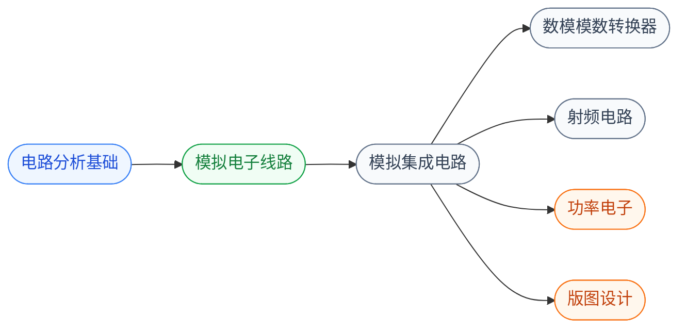

# 模拟与射频

模拟电路处理**连续变化的真实世界信号**(电压、电流、温度、压力):用晶体管搭放大器、滤波器、振荡器,在硅片上做运放、PLL、ADC、DAC、PA、LNA 等模拟模块。

模拟电路是 IC 设计中**最依赖经验和直觉**的领域——一个有 10 年经验的模拟工程师设计的运放可能比刚毕业生快 10 倍且性能更好。这是因为模拟设计的反馈、稳定性、噪声、失配等问题没有“标准流程”,更多依靠对器件物理的深刻理解 + 大量电路 topology 的积累。

## 子目录

- **[电路分析基础](/guide/ic-guide/%E5%AD%A6%E4%B9%A0%E5%9C%B0%E5%9B%BE/%E7%94%B5%E8%B7%AF/%E6%A8%A1%E6%8B%9F%E4%B8%8E%E5%B0%84%E9%A2%91/%E7%94%B5%E8%B7%AF%E5%88%86%E6%9E%90%E5%9F%BA%E7%A1%80/FDU_yiting)** — 欧姆/基尔霍夫定律,RLC 网络分析
- **[模拟电子线路](/guide/ic-guide/%E5%AD%A6%E4%B9%A0%E5%9C%B0%E5%9B%BE/%E7%94%B5%E8%B7%AF/%E6%A8%A1%E6%8B%9F%E4%B8%8E%E5%B0%84%E9%A2%91/%E6%A8%A1%E6%8B%9F%E7%94%B5%E5%AD%90%E7%BA%BF%E8%B7%AF/FDU_MICR130002)** — 用晶体管搭基本模块(放大器、滤波器、振荡器)
- **[模拟集成电路](/guide/ic-guide/%E5%AD%A6%E4%B9%A0%E5%9C%B0%E5%9B%BE/%E7%94%B5%E8%B7%AF/%E6%A8%A1%E6%8B%9F%E4%B8%8E%E5%B0%84%E9%A2%91/%E6%A8%A1%E6%8B%9F%E9%9B%86%E6%88%90%E7%94%B5%E8%B7%AF/FDU_MICR130030)** — 在芯片上实现高性能模拟模块
- **[ADC / DAC](/guide/ic-guide/%E5%AD%A6%E4%B9%A0%E5%9C%B0%E5%9B%BE/%E7%94%B5%E8%B7%AF/%E6%A8%A1%E6%8B%9F%E4%B8%8E%E5%B0%84%E9%A2%91/%E6%95%B0%E6%A8%A1%E6%A8%A1%E6%95%B0%E8%BD%AC%E6%8D%A2%E5%99%A8/FDU_INFO130270)** — 数据转换器,模拟与数字世界的桥梁,先修是模拟集成电路
- **[射频电路](/guide/ic-guide/%E5%AD%A6%E4%B9%A0%E5%9C%B0%E5%9B%BE/%E7%94%B5%E8%B7%AF/%E6%A8%A1%E6%8B%9F%E4%B8%8E%E5%B0%84%E9%A2%91/%E5%B0%84%E9%A2%91%E7%94%B5%E8%B7%AF/XDU_high_freq)** — 从板级高频电路(传输线、S 参数)到片上射频 IC(LNA、PA、混频器、VCO)

## 相关科研方向

- [模拟与混合信号 IC](/guide/ic-guide/%E7%A7%91%E7%A0%94%E6%96%B9%E5%90%91/%E6%A8%A1%E6%8B%9F%E4%B8%8E%E6%B7%B7%E5%90%88%E4%BF%A1%E5%8F%B7IC)
- [射频与毫米波 IC](/guide/ic-guide/%E7%A7%91%E7%A0%94%E6%96%B9%E5%90%91/%E5%B0%84%E9%A2%91%E4%B8%8E%E6%AF%AB%E7%B1%B3%E6%B3%A2IC)
- [生物电子与脑机接口](/guide/ic-guide/%E7%A7%91%E7%A0%94%E6%96%B9%E5%90%91/%E7%94%9F%E7%89%A9%E7%94%B5%E5%AD%90%E4%B8%8E%E8%84%91%E6%9C%BA%E6%8E%A5%E5%8F%A3)

