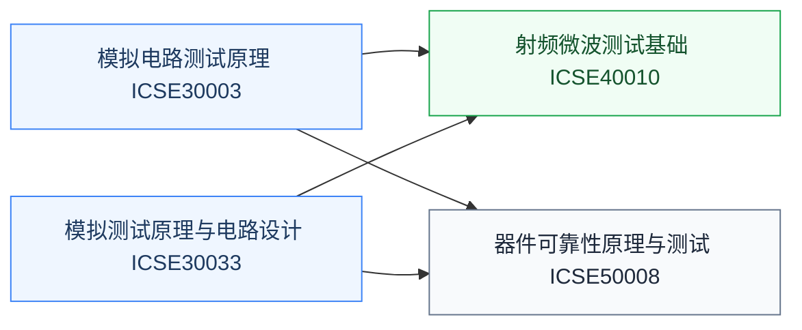

# 测试与可靠性

芯片造出来要证明它能用、能一直用。测试覆盖从晶圆级 CP 到成品 FT 的量产环节，可靠性研究器件和电路的退化机制。这是数字验证之外另一大就业岗位类别，模拟/射频岗位尤其看重。数字侧的功能验证（SV/UVM）见[数字验证](/guide/ic-guide/%E5%AD%A6%E4%B9%A0%E5%9C%B0%E5%9B%BE/%E7%94%B5%E8%B7%AF/%E6%95%B0%E5%AD%97%E8%AE%BE%E8%AE%A1/%E6%95%B0%E5%AD%97%E9%AA%8C%E8%AF%81/index)槽位。

## 复旦校内课程（2025 培养方案）

以下课程页为占位骨架，欢迎修过的同学通过[参与建设](/guide/ic-guide/%E5%8F%82%E4%B8%8E%E5%BB%BA%E8%AE%BE)补全：

- **[模拟电路测试原理](/guide/ic-guide/%E5%AD%A6%E4%B9%A0%E5%9C%B0%E5%9B%BE/%E7%94%B5%E8%B7%AF/%E6%B5%8B%E8%AF%95%E4%B8%8E%E5%8F%AF%E9%9D%A0%E6%80%A7/FDU_ICSE30003)** — 模拟量测试方法
- **[模拟测试原理与电路设计](/guide/ic-guide/%E5%AD%A6%E4%B9%A0%E5%9C%B0%E5%9B%BE/%E7%94%B5%E8%B7%AF/%E6%B5%8B%E8%AF%95%E4%B8%8E%E5%8F%AF%E9%9D%A0%E6%80%A7/FDU_ICSE30033)** — IV 测试与可测性设计
- **[射频微波测试基础](/guide/ic-guide/%E5%AD%A6%E4%B9%A0%E5%9C%B0%E5%9B%BE/%E7%94%B5%E8%B7%AF/%E6%B5%8B%E8%AF%95%E4%B8%8E%E5%8F%AF%E9%9D%A0%E6%80%A7/FDU_ICSE40010)** — S 参数、噪声系数等射频量测
- **[器件可靠性原理与测试](/guide/ic-guide/%E5%AD%A6%E4%B9%A0%E5%9C%B0%E5%9B%BE/%E7%94%B5%E8%B7%AF/%E6%B5%8B%E8%AF%95%E4%B8%8E%E5%8F%AF%E9%9D%A0%E6%80%A7/FDU_ICSE50008)** — HCI/BTI/TDDB 等退化机制与表征

## 公开课程（待补充）

测试与可靠性的公开视频课程稀缺，欢迎推荐（要求：完整公开视频，附主页与直链，注明学校、教师、讲数）。

## 相关科研方向

- [模拟与混合信号 IC](/guide/ic-guide/%E7%A7%91%E7%A0%94%E6%96%B9%E5%90%91/%E6%A8%A1%E6%8B%9F%E4%B8%8E%E6%B7%B7%E5%90%88%E4%BF%A1%E5%8F%B7IC)
- [射频与毫米波 IC](/guide/ic-guide/%E7%A7%91%E7%A0%94%E6%96%B9%E5%90%91/%E5%B0%84%E9%A2%91%E4%B8%8E%E6%AF%AB%E7%B1%B3%E6%B3%A2IC)
- [半导体器件与先进工艺](/guide/ic-guide/%E7%A7%91%E7%A0%94%E6%96%B9%E5%90%91/%E5%8D%8A%E5%AF%BC%E4%BD%93%E5%99%A8%E4%BB%B6%E4%B8%8E%E5%85%88%E8%BF%9B%E5%B7%A5%E8%89%BA)

