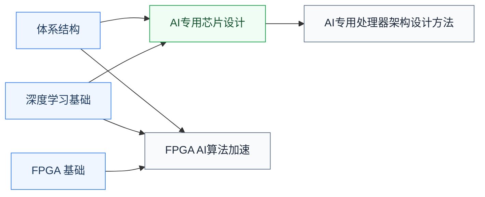

# AI加速器

为 AI 工作负载设计专用计算芯片这条线，与 [GPU体系结构](/guide/ic-guide/%E5%AD%A6%E4%B9%A0%E5%9C%B0%E5%9B%BE/%E7%B3%BB%E7%BB%9F%E6%9E%B6%E6%9E%84/GPU%E4%BD%93%E7%B3%BB%E7%BB%93%E6%9E%84/index)并列。前置是[体系结构](/guide/ic-guide/%E5%AD%A6%E4%B9%A0%E5%9C%B0%E5%9B%BE/%E7%B3%BB%E7%BB%9F%E6%9E%B6%E6%9E%84/%E4%BD%93%E7%B3%BB%E7%BB%93%E6%9E%84/index)，算法侧搭配[人工智能板块](/guide/ic-guide/%E5%AD%A6%E4%B9%A0%E5%9C%B0%E5%9B%BE/%E4%BA%BA%E5%B7%A5%E6%99%BA%E8%83%BD/index)的深度学习基础。

## 复旦校内课程（2025 培养方案）

以下课程页为占位骨架，欢迎修过的同学通过[参与建设](/guide/ic-guide/%E5%8F%82%E4%B8%8E%E5%BB%BA%E8%AE%BE)补全：

- **[智能计算芯片导论](/guide/ic-guide/%E5%AD%A6%E4%B9%A0%E5%9C%B0%E5%9B%BE/%E7%B3%BB%E7%BB%9F%E6%9E%B6%E6%9E%84/AI%E5%8A%A0%E9%80%9F%E5%99%A8/FDU_ICSE30034)** — Transformer、LLM 与芯片加速基础
- **[AI专用处理器架构设计方法](/guide/ic-guide/%E5%AD%A6%E4%B9%A0%E5%9C%B0%E5%9B%BE/%E7%B3%BB%E7%BB%9F%E6%9E%B6%E6%9E%84/AI%E5%8A%A0%E9%80%9F%E5%99%A8/FDU_ICSE40002)** — DSA 架构设计方法
- **[AI专用芯片设计](/guide/ic-guide/%E5%AD%A6%E4%B9%A0%E5%9C%B0%E5%9B%BE/%E7%B3%BB%E7%BB%9F%E6%9E%B6%E6%9E%84/AI%E5%8A%A0%E9%80%9F%E5%99%A8/FDU_ICSE30036)** — AI 芯片设计实践
- **[基于FPGA的人工智能算法加速及应用](/guide/ic-guide/%E5%AD%A6%E4%B9%A0%E5%9C%B0%E5%9B%BE/%E7%B3%BB%E7%BB%9F%E6%9E%B6%E6%9E%84/AI%E5%8A%A0%E9%80%9F%E5%99%A8/FDU_ICSE40018)** — 用 FPGA 实现 AI 加速，先修 [FPGA](/guide/ic-guide/%E5%AD%A6%E4%B9%A0%E5%9C%B0%E5%9B%BE/%E7%94%B5%E8%B7%AF/%E6%95%B0%E5%AD%97%E8%AE%BE%E8%AE%A1/FPGA/FDU_MICR130024)

## 公开课程（待补充）

加速器设计的公开课欢迎推荐；软件侧的模型压缩与部署见[人工智能/AI系统](/guide/ic-guide/%E5%AD%A6%E4%B9%A0%E5%9C%B0%E5%9B%BE/%E4%BA%BA%E5%B7%A5%E6%99%BA%E8%83%BD/AI%E7%B3%BB%E7%BB%9F/index)（MIT 6.5940、CMU 10-414）。

## 相关科研方向

- [AI 算法与系统](/guide/ic-guide/%E7%A7%91%E7%A0%94%E6%96%B9%E5%90%91/AI%E7%AE%97%E6%B3%95%E4%B8%8E%E7%B3%BB%E7%BB%9F)
- [处理器架构与编译系统](/guide/ic-guide/%E7%A7%91%E7%A0%94%E6%96%B9%E5%90%91/%E5%A4%84%E7%90%86%E5%99%A8%E6%9E%B6%E6%9E%84%E4%B8%8E%E7%BC%96%E8%AF%91%E7%B3%BB%E7%BB%9F)
- [存算一体与近存计算](/guide/ic-guide/%E7%A7%91%E7%A0%94%E6%96%B9%E5%90%91/%E5%AD%98%E7%AE%97%E4%B8%80%E4%BD%93%E4%B8%8E%E8%BF%91%E5%AD%98%E8%AE%A1%E7%AE%97)
- [可重构计算与FPGA](/guide/ic-guide/%E7%A7%91%E7%A0%94%E6%96%B9%E5%90%91/%E5%8F%AF%E9%87%8D%E6%9E%84%E8%AE%A1%E7%AE%97%E4%B8%8EFPGA)

