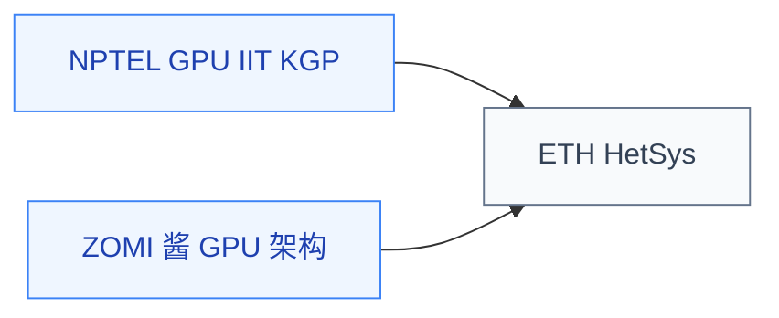

# GPU 体系结构

GPU 是现代 AI 训练、图形渲染、科学计算的核心硬件。GPU 体系结构研究 **warp 调度、访存合并、缓存层次、Tensor Core 微架构、HBM 内存接口** 等问题——这些是 AI 芯片设计、GPU 微架构研究、系统级性能优化的基础。

与并行编程（CS149 等）不同，GPU 体系结构关注的是**硬件内部如何运作**，而非如何写并行程序。

## 相关科研方向

- [AI 算法与系统](/guide/ic-guide/%E7%A7%91%E7%A0%94%E6%96%B9%E5%90%91/AI%E7%AE%97%E6%B3%95%E4%B8%8E%E7%B3%BB%E7%BB%9F)
- [处理器架构与编译系统](/guide/ic-guide/%E7%A7%91%E7%A0%94%E6%96%B9%E5%90%91/%E5%A4%84%E7%90%86%E5%99%A8%E6%9E%B6%E6%9E%84%E4%B8%8E%E7%BC%96%E8%AF%91%E7%B3%BB%E7%BB%9F)

