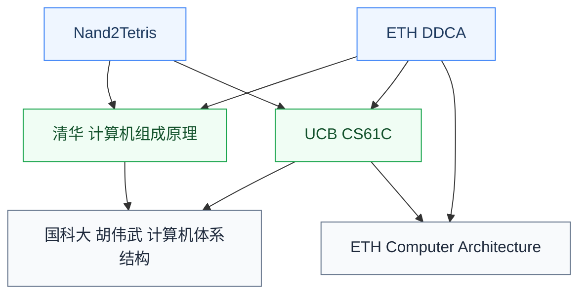

# 计算机体系结构

体系结构(Computer Architecture)研究**处理器及计算系统的设计**:指令集架构(ISA)、流水线、超标量、缓存层次、内存系统、多核、加速器、GPU 等。这是与硬件设计交叉最深的 CS 子方向,也是 IC 研究生最常选择的“软硬交叉”方向之一。

## 相关科研方向

- [处理器架构与编译系统](/guide/ic-guide/%E7%A7%91%E7%A0%94%E6%96%B9%E5%90%91/%E5%A4%84%E7%90%86%E5%99%A8%E6%9E%B6%E6%9E%84%E4%B8%8E%E7%BC%96%E8%AF%91%E7%B3%BB%E7%BB%9F)
- [可重构计算与FPGA](/guide/ic-guide/%E7%A7%91%E7%A0%94%E6%96%B9%E5%90%91/%E5%8F%AF%E9%87%8D%E6%9E%84%E8%AE%A1%E7%AE%97%E4%B8%8EFPGA)
- [存算一体与近存计算](/guide/ic-guide/%E7%A7%91%E7%A0%94%E6%96%B9%E5%90%91/%E5%AD%98%E7%AE%97%E4%B8%80%E4%BD%93%E4%B8%8E%E8%BF%91%E5%AD%98%E8%AE%A1%E7%AE%97)

