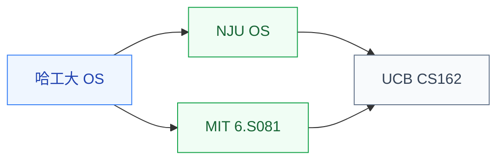

# 操作系统

操作系统研究**软件如何管理硬件资源**:进程调度、内存管理、文件系统、I/O 子系统、虚拟化、中断处理。它是系统类研究的“中间层”:上接编译/应用,下连体系结构。

对硬件方向的同学来说,操作系统是**理解软硬件协同**的关键——设计的硬件特性(缓存替换策略、虚拟内存、加速器接口)最终都需要 OS 适配才能被应用使用。

## 相关科研方向

- [处理器架构与编译系统](/guide/ic-guide/%E7%A7%91%E7%A0%94%E6%96%B9%E5%90%91/%E5%A4%84%E7%90%86%E5%99%A8%E6%9E%B6%E6%9E%84%E4%B8%8E%E7%BC%96%E8%AF%91%E7%B3%BB%E7%BB%9F)
- [硬件安全与可信计算](/guide/ic-guide/%E7%A7%91%E7%A0%94%E6%96%B9%E5%90%91/%E7%A1%AC%E4%BB%B6%E5%AE%89%E5%85%A8%E4%B8%8E%E5%8F%AF%E4%BF%A1%E8%AE%A1%E7%AE%97)
- [AI 算法与系统](/guide/ic-guide/%E7%A7%91%E7%A0%94%E6%96%B9%E5%90%91/AI%E7%AE%97%E6%B3%95%E4%B8%8E%E7%B3%BB%E7%BB%9F)

