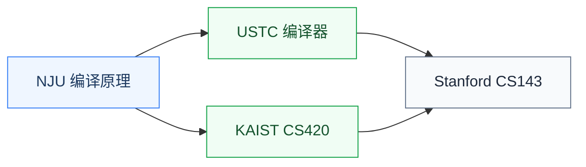

# 编译原理

编译原理研究**如何把高级语言翻译成可执行代码**:词法分析、语法分析、中间表示(IR)、代码优化、目标代码生成。它是连接编程语言与硬件指令的桥梁。

对硬件研究者来说,编译原理是 **AI 编译器(TVM/MLIR)、EDA 综合工具、硬件描述语言研究** 的直接前置。当今最热的领域如 AI 系统、领域特定语言(DSL)、加速器编译都依赖这门课的核心技能。

## 相关科研方向

- [处理器架构与编译系统](/guide/ic-guide/%E7%A7%91%E7%A0%94%E6%96%B9%E5%90%91/%E5%A4%84%E7%90%86%E5%99%A8%E6%9E%B6%E6%9E%84%E4%B8%8E%E7%BC%96%E8%AF%91%E7%B3%BB%E7%BB%9F)
- [AI 算法与系统](/guide/ic-guide/%E7%A7%91%E7%A0%94%E6%96%B9%E5%90%91/AI%E7%AE%97%E6%B3%95%E4%B8%8E%E7%B3%BB%E7%BB%9F)
- [EDA 与设计自动化](/guide/ic-guide/%E7%A7%91%E7%A0%94%E6%96%B9%E5%90%91/EDA%E4%B8%8E%E8%AE%BE%E8%AE%A1%E8%87%AA%E5%8A%A8%E5%8C%96)

