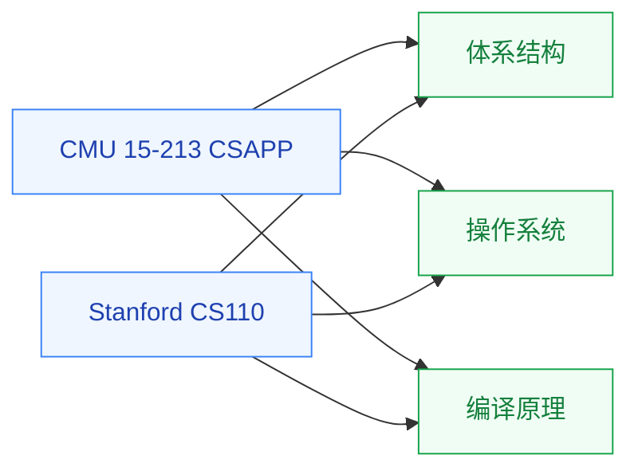

# 计算机系统基础

计算机系统基础是**所有“系统类”研究的入口**——它把“程序如何在硬件上运行”这件事讲清楚,涵盖汇编语言、内存模型、缓存层次、进程与线程、链接与加载、I/O 系统等核心概念。这是 [体系结构](../体系结构/)、[操作系统](../操作系统/)、[编译原理](../编译原理/) 的共同前置。

## 相关科研方向

- [处理器架构与编译系统](/guide/ic-guide/%E7%A7%91%E7%A0%94%E6%96%B9%E5%90%91/%E5%A4%84%E7%90%86%E5%99%A8%E6%9E%B6%E6%9E%84%E4%B8%8E%E7%BC%96%E8%AF%91%E7%B3%BB%E7%BB%9F)
- [存算一体与近存计算](/guide/ic-guide/%E7%A7%91%E7%A0%94%E6%96%B9%E5%90%91/%E5%AD%98%E7%AE%97%E4%B8%80%E4%BD%93%E4%B8%8E%E8%BF%91%E5%AD%98%E8%AE%A1%E7%AE%97)
- [硬件安全与可信计算](/guide/ic-guide/%E7%A7%91%E7%A0%94%E6%96%B9%E5%90%91/%E7%A1%AC%E4%BB%B6%E5%AE%89%E5%85%A8%E4%B8%8E%E5%8F%AF%E4%BF%A1%E8%AE%A1%E7%AE%97)

