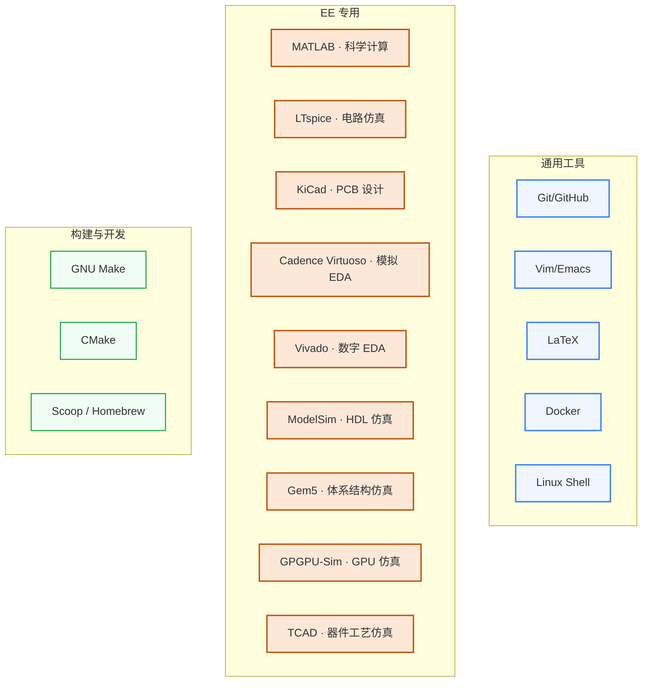

# 工程工具

工具不是用来“学完”的,而是**学到顺手**就够。这一板块覆盖做研究的常用工具,从代码协作(Git/GitHub)到论文撰写(LaTeX),从 EE 仿真(LTspice/Cadence)到体系结构仿真(Gem5/GPGPU-Sim)。

## 知识谱系

## [通用工具](/guide/ic-guide/%E5%B7%A5%E7%A8%8B%E5%B7%A5%E5%85%B7/Git)

任何方向都需要的工具:版本控制、文本编辑、论文写作、容器化、信息检索。不熟练这些会显著影响科研效率。

- **[Git](/guide/ic-guide/%E5%B7%A5%E7%A8%8B%E5%B7%A5%E5%85%B7/Git) / [GitHub](/guide/ic-guide/%E5%B7%A5%E7%A8%8B%E5%B7%A5%E5%85%B7/GitHub)** — 代码版本控制 + 协作的事实标准
- **[Vim](/guide/ic-guide/%E5%B7%A5%E7%A8%8B%E5%B7%A5%E5%85%B7/Vim)** — 高效文本编辑;远程服务器上没 IDE 时必备
- **[LaTeX](/guide/ic-guide/%E5%B7%A5%E7%A8%8B%E5%B7%A5%E5%85%B7/LaTeX)** — 论文/简历/PPT 排版,IEEE/ACM 等顶会模板都用 LaTeX
- **[Docker](/guide/ic-guide/%E5%B7%A5%E7%A8%8B%E5%B7%A5%E5%85%B7/Docker)** — 跑别人的代码再也不用配环境(尤其重要于 ML/EDA 工具复现)
- **[日常学习工作流](/guide/ic-guide/%E5%B7%A5%E7%A8%8B%E5%B7%A5%E5%85%B7/workflow)** / **[实用工具箱](/guide/ic-guide/%E5%B7%A5%E7%A8%8B%E5%B7%A5%E5%85%B7/tools)** / **[信息检索](/guide/ic-guide/%E5%B7%A5%E7%A8%8B%E5%B7%A5%E5%85%B7/%E4%BF%A1%E6%81%AF%E6%A3%80%E7%B4%A2)** / **[毕业论文](/guide/ic-guide/%E5%B7%A5%E7%A8%8B%E5%B7%A5%E5%85%B7/thesis)** — 软技能合集

## [EE 专用工具](/guide/ic-guide/%E5%B7%A5%E7%A8%8B%E5%B7%A5%E5%85%B7/%E7%A7%91%E5%AD%A6%E8%AE%A1%E7%AE%97)

只有做 IC/EE 才会接触的专业工具:

- **[MATLAB / 科学计算](/guide/ic-guide/%E5%B7%A5%E7%A8%8B%E5%B7%A5%E5%85%B7/%E7%A7%91%E5%AD%A6%E8%AE%A1%E7%AE%97)** — 信号处理、控制、仿真原型
- **[LTspice](/guide/ic-guide/%E5%B7%A5%E7%A8%8B%E5%B7%A5%E5%85%B7/LTspice)** — 模拟电路仿真,免费且工业级
- **[KiCad](/guide/ic-guide/%E5%B7%A5%E7%A8%8B%E5%B7%A5%E5%85%B7/KiCad)** — PCB 设计开源神器
- **[Cadence Virtuoso](/guide/ic-guide/%E5%AD%A6%E4%B9%A0%E5%9C%B0%E5%9B%BE/%E7%94%B5%E8%B7%AF/EDA/cadence)** — 模拟 IC 设计工业标准
- **[Vivado](/guide/ic-guide/%E5%AD%A6%E4%B9%A0%E5%9C%B0%E5%9B%BE/%E7%94%B5%E8%B7%AF/EDA/vivado)** — Xilinx FPGA 综合 + 实现
- **[ModelSim](/guide/ic-guide/%E5%B7%A5%E7%A8%8B%E5%B7%A5%E5%85%B7/ModelSim)** — HDL 仿真器(数字验证入门)
- **[Gem5](/guide/ic-guide/%E5%B7%A5%E7%A8%8B%E5%B7%A5%E5%85%B7/Gem5)** — 体系结构研究的”国民仿真器”,ISCA/MICRO 标配
- **[GPGPU-Sim](/guide/ic-guide/%E5%B7%A5%E7%A8%8B%E5%B7%A5%E5%85%B7/GPGPUSIM)** — GPU 仿真,做 GPU 架构研究必备
- **[TCAD](/guide/ic-guide/%E5%B7%A5%E7%A8%8B%E5%B7%A5%E5%85%B7/TCAD)** — 器件物理与工艺仿真,Sentaurus / Silvaco

## [构建与开发](/guide/ic-guide/%E5%B7%A5%E7%A8%8B%E5%B7%A5%E5%85%B7/GNU_Make)

写大项目时绕不开的构建系统:

- **[GNU Make](/guide/ic-guide/%E5%B7%A5%E7%A8%8B%E5%B7%A5%E5%85%B7/GNU_Make)** — 经典构建工具,所有 EDA 项目都还在用
- **[CMake](/guide/ic-guide/%E5%B7%A5%E7%A8%8B%E5%B7%A5%E5%85%B7/CMake)** — 现代 C++ 项目标配
- **[Scoop](/guide/ic-guide/%E5%B7%A5%E7%A8%8B%E5%B7%A5%E5%85%B7/Scoop)** — Windows 包管理(类似 Mac 的 Homebrew)
- **[Emacs](/guide/ic-guide/%E5%B7%A5%E7%A8%8B%E5%B7%A5%E5%85%B7/Emacs)** — 与 Vim 二选一的资深编辑器

## 对科研方向的作用

| 方向 | 必备工具 |
|---|---|
| [处理器架构与编译系统](/guide/ic-guide/%E7%A7%91%E7%A0%94%E6%96%B9%E5%90%91/%E5%A4%84%E7%90%86%E5%99%A8%E6%9E%B6%E6%9E%84%E4%B8%8E%E7%BC%96%E8%AF%91%E7%B3%BB%E7%BB%9F) | Gem5 + GPGPU-Sim + Linux Shell |
| [模拟与混合信号 IC](/guide/ic-guide/%E7%A7%91%E7%A0%94%E6%96%B9%E5%90%91/%E6%A8%A1%E6%8B%9F%E4%B8%8E%E6%B7%B7%E5%90%88%E4%BF%A1%E5%8F%B7IC) | Cadence Virtuoso + LTspice + MATLAB |
| [可重构计算与FPGA](/guide/ic-guide/%E7%A7%91%E7%A0%94%E6%96%B9%E5%90%91/%E5%8F%AF%E9%87%8D%E6%9E%84%E8%AE%A1%E7%AE%97%E4%B8%8EFPGA) | Vivado + ModelSim + Verilog/Chisel |
| [EDA 与设计自动化](/guide/ic-guide/%E7%A7%91%E7%A0%94%E6%96%B9%E5%90%91/EDA%E4%B8%8E%E8%AE%BE%E8%AE%A1%E8%87%AA%E5%8A%A8%E5%8C%96) | Cadence/Synopsys + Python + C++ + Make/CMake |
| [AI 算法与系统](/guide/ic-guide/%E7%A7%91%E7%A0%94%E6%96%B9%E5%90%91/AI%E7%AE%97%E6%B3%95%E4%B8%8E%E7%B3%BB%E7%BB%9F) | Docker + Git + Python 生态 |
| [半导体器件与先进工艺](/guide/ic-guide/%E7%A7%91%E7%A0%94%E6%96%B9%E5%90%91/%E5%8D%8A%E5%AF%BC%E4%BD%93%E5%99%A8%E4%BB%B6%E4%B8%8E%E5%85%88%E8%BF%9B%E5%B7%A5%E8%89%BA) | TCAD（Sentaurus / Silvaco）|
| [功率半导体与宽禁带器件](/guide/ic-guide/%E7%A7%91%E7%A0%94%E6%96%B9%E5%90%91/%E5%8A%9F%E7%8E%87%E5%8D%8A%E5%AF%BC%E4%BD%93%E4%B8%8E%E5%AE%BD%E7%A6%81%E5%B8%A6%E5%99%A8%E4%BB%B6) | TCAD + LTspice |
| 任何方向 | Git + LaTeX + Linux Shell |
